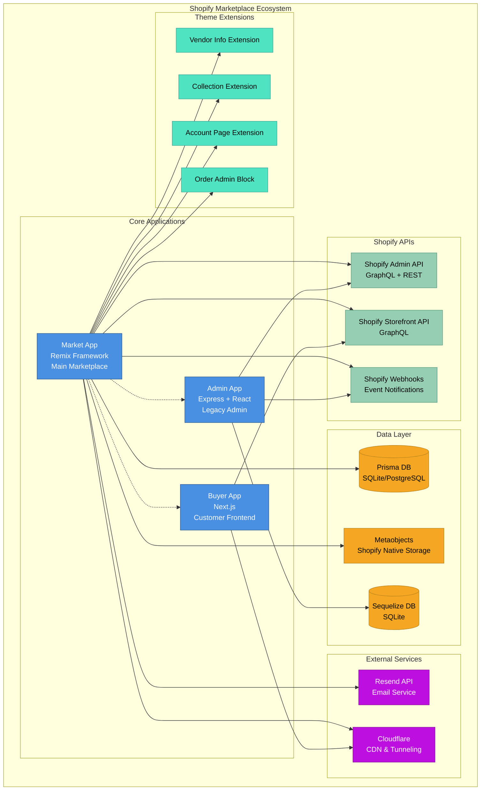
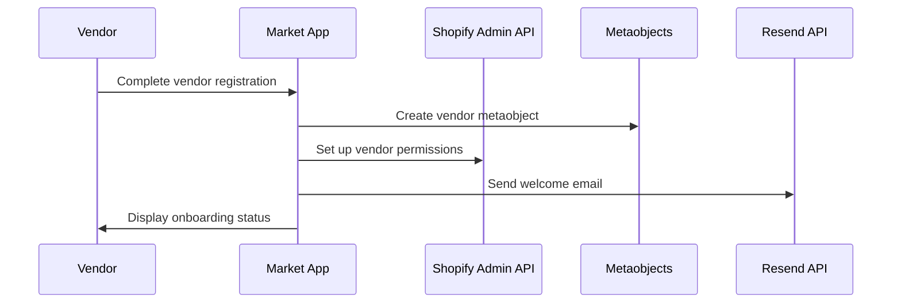
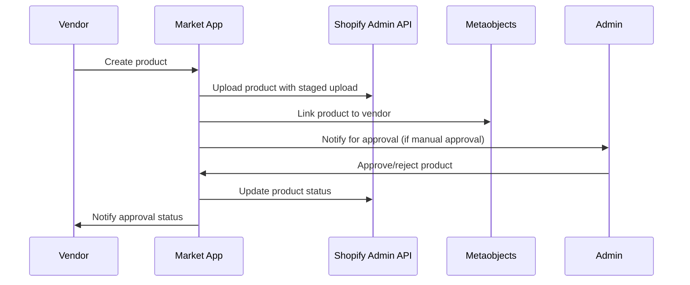
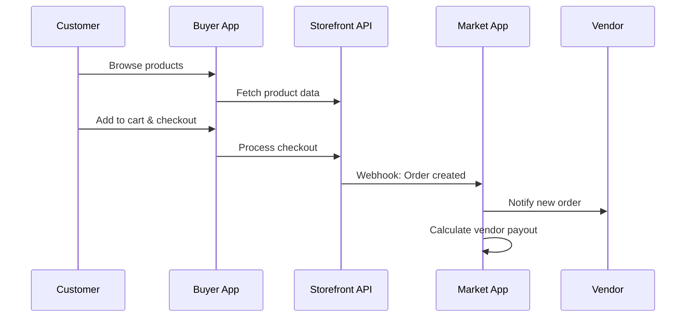
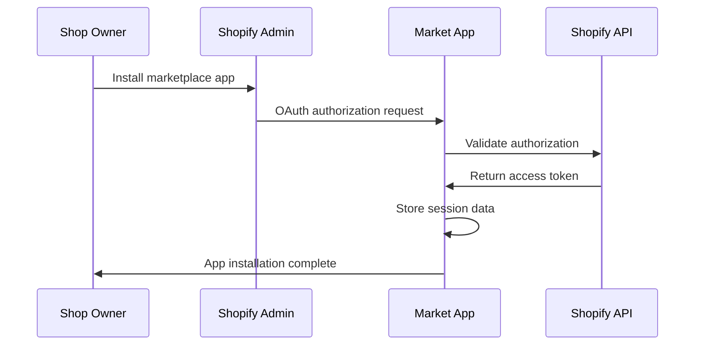
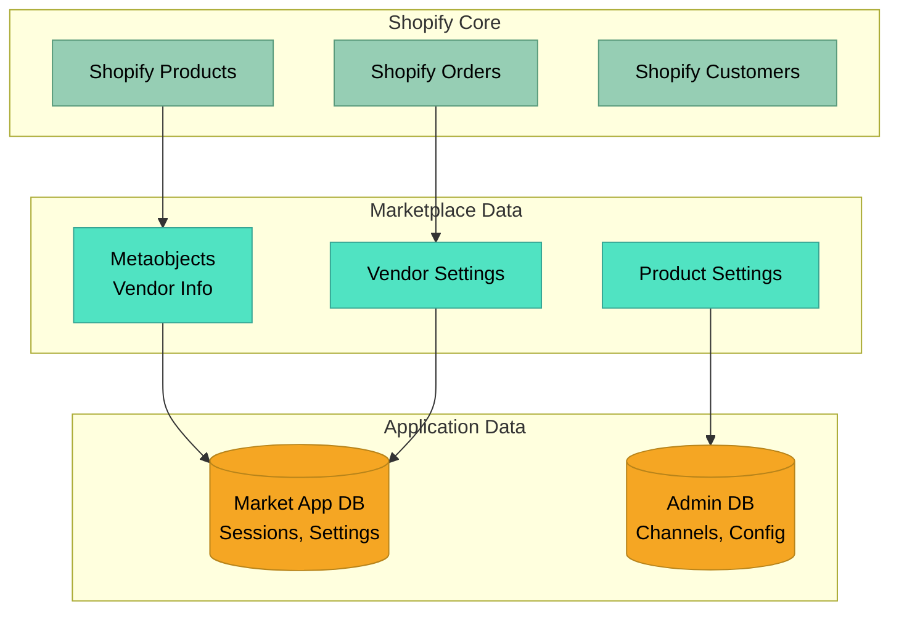

# System Overview

This document provides a high-level overview of the Shopify Marketplace Remix App architecture, including all applications, their relationships, and core workflows.

## 🏗️ High-Level Architecture

## 📱 Application Overview

### Market App (Primary Application)
- **Framework**: Remix (React-based full-stack framework)
- **Purpose**: Main marketplace application for vendors and marketplace management
- **Key Features**:
  - Vendor onboarding and management
  - Product creation and approval workflows
  - Order management and payouts
  - Marketplace administration
  - Theme app extensions

### Admin App (Legacy)
- **Framework**: Express.js + React
- **Purpose**: Legacy admin functionality and channel management
- **Key Features**:
  - Channel management
  - Shop configuration
  - Legacy admin workflows
  - GraphQL server with Apollo

### Buyer App (Customer Frontend)
- **Framework**: Next.js
- **Purpose**: Customer-facing marketplace frontend
- **Key Features**:
  - Product browsing and search
  - Shopping cart and checkout
  - Vendor profiles
  - Multi-vendor marketplace experience

## 🔄 Core Workflows

### Vendor Onboarding Flow

### Product Creation & Approval Flow

### Customer Purchase Flow

## 🛠️ Technology Integration Points

### Shopify Integration
- **Admin API**: Product management, order processing, metaobject operations
- **Storefront API**: Customer-facing product data and checkout
- **Webhooks**: Real-time event processing for orders, products, and app lifecycle
- **App Bridge**: Embedded app experience within Shopify admin

### Database Strategy
- **Market App**: Uses Prisma with SQLite (production: PostgreSQL)
- **Admin App**: Uses Sequelize with SQLite
- **Metaobjects**: Native Shopify storage for vendor and product metadata

### Theme Extensions
- **Vendor Info Extension**: Displays vendor information on product pages
- **Collection Extension**: Shows vendor-specific collections
- **Account Extension**: Vendor dashboard in customer accounts
- **Admin Order Block**: Vendor information in admin order view

## 🔐 Security & Authentication

### OAuth Flow

### Session Management
- **Market App**: Uses Prisma session storage with encrypted tokens
- **Admin App**: Custom session storage with database persistence
- **Cross-App**: Independent session management per application

## 📊 Data Architecture

### Data Flow Hierarchy

## 🚀 Deployment Model

The system follows a multi-app deployment strategy:
- **Market App**: Primary Remix application (main domain)
- **Admin App**: Legacy Express app (subdomain or separate domain)
- **Buyer App**: Next.js static/SSR deployment (customer-facing domain)
- **Extensions**: Deployed via Shopify CLI to Shopify's infrastructure

## 📈 Scalability Considerations

### Horizontal Scaling
- Each app can be scaled independently
- Database connections managed per app
- Shopify API rate limiting handled per app

### Performance Optimization
- **Market App**: Server-side rendering with Remix
- **Buyer App**: Static generation with Next.js
- **Admin App**: Client-side rendering with React
- **CDN**: Cloudflare for static assets and API acceleration

---

**Next:** [Technology Stack →](./02-technology-stack.md)