# Technology Stack

This document details the complete technology stack used across all applications in the Shopify Marketplace ecosystem.

## 🏗️ Technology Stack Overview

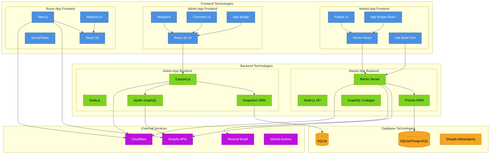

## 📦 Detailed Technology Breakdown

### Market App (Primary Application)

#### Frontend Stack
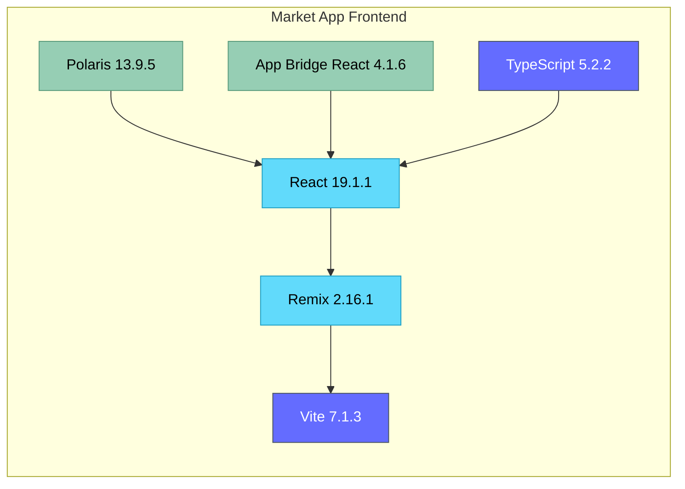

**Key Technologies:**
- **React 19.1.1**: Latest React with concurrent features
- **Remix 2.16.1**: Full-stack React framework with SSR
- **Vite 7.1.3**: Fast build tool and dev server
- **TypeScript 5.2.2**: Type safety and developer experience
- **Shopify Polaris 13.9.5**: Shopify's design system
- **App Bridge React 4.1.6**: Shopify admin integration

#### Backend Stack
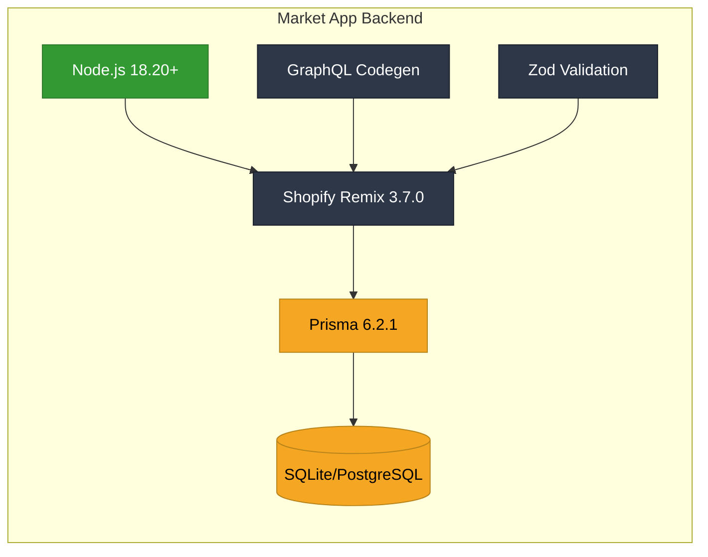

**Key Technologies:**
- **Node.js 18.20+**: Runtime environment
- **Shopify App Remix 3.7.0**: Shopify's Remix integration
- **Prisma 6.2.1**: Modern ORM with type safety
- **GraphQL Codegen**: Automatic type generation
- **SQLite**: Development database
- **PostgreSQL**: Production database

### Admin App (Legacy)

#### Frontend Stack
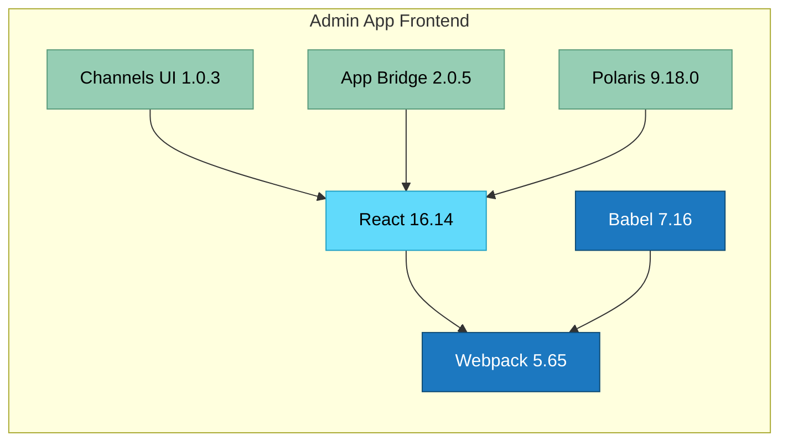

**Key Technologies:**
- **React 16.14**: Stable React version
- **Webpack 5.65**: Module bundler
- **Channels UI 1.0.3**: Shopify channels design system
- **App Bridge 2.0.5**: Shopify admin integration
- **Babel 7.16**: JavaScript transpilation

#### Backend Stack
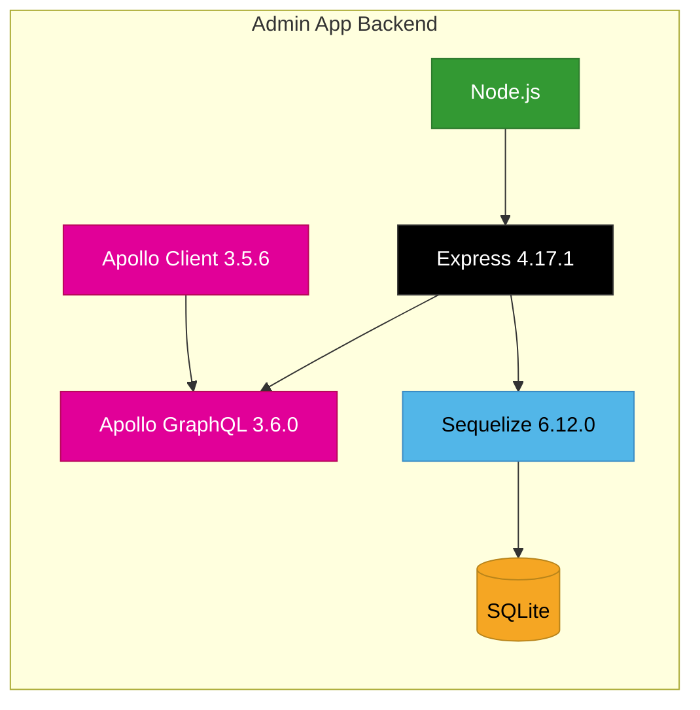

**Key Technologies:**
- **Express 4.17.1**: Web application framework
- **Apollo Server 3.6.0**: GraphQL server
- **Sequelize 6.12.0**: Promise-based ORM
- **SQLite**: Database for sessions and configuration

### Buyer App (Customer Frontend)

#### Frontend Stack
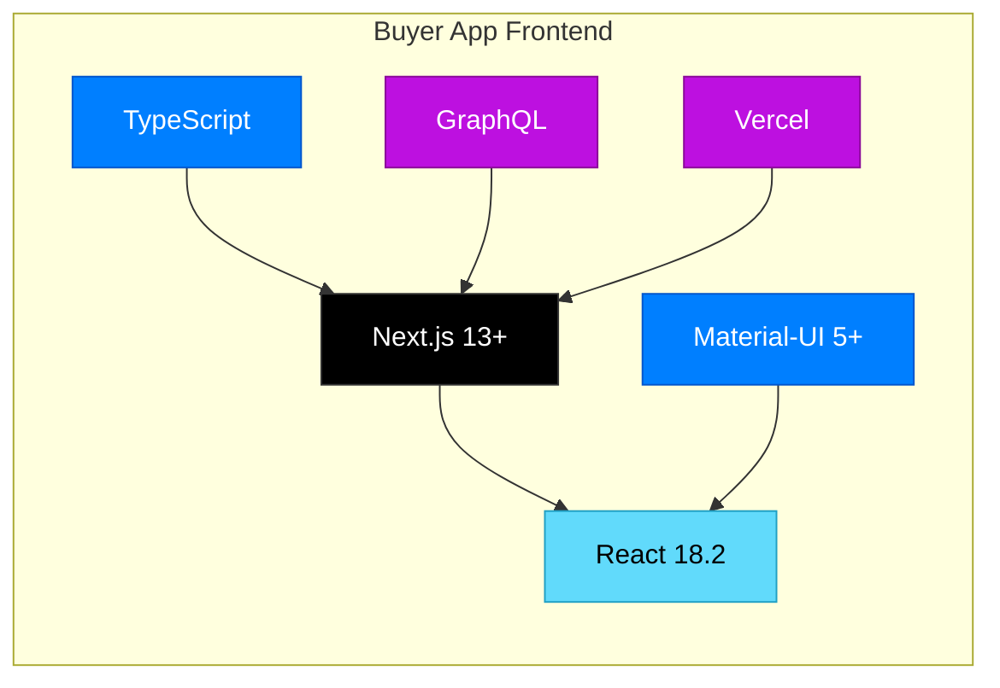

**Key Technologies:**
- **Next.js**: React framework with SSG/SSR
- **React 18.2**: Modern React with concurrent features
- **Material-UI**: Google's Material Design components
- **TypeScript**: Type safety
- **GraphQL**: Data fetching from Shopify Storefront API

## 🔧 Development Tools & Build Process

### Package Management
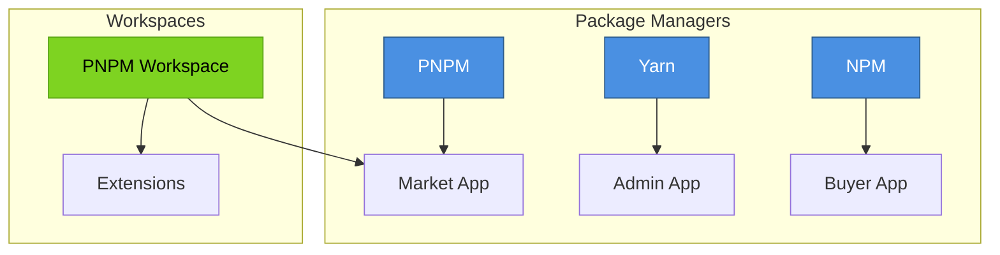

### Build & Bundling
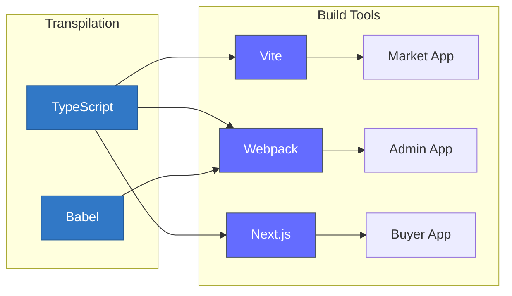

### Code Quality & Linting
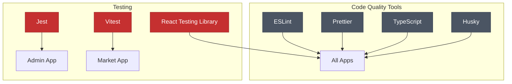

## 🗄️ Database Technologies

### Database Comparison
| Feature | Market App (Prisma) | Admin App (Sequelize) | Shopify Metaobjects |
|---------|---------------------|------------------------|---------------------|
| **ORM/ODM** | Prisma 6.2.1 | Sequelize 6.12.0 | Native GraphQL |
| **Database** | SQLite → PostgreSQL | SQLite | Shopify Native |
| **Migrations** | Prisma Migrate | Sequelize CLI | Version controlled |
| **Type Safety** | Full TypeScript | Partial | GraphQL Schema |
| **Performance** | High (compiled queries) | Good | Optimized by Shopify |

### Data Storage Strategy
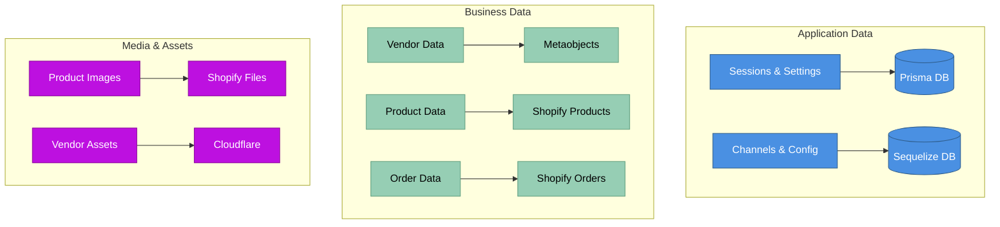

## 🚀 Deployment & Infrastructure

### Hosting Platforms
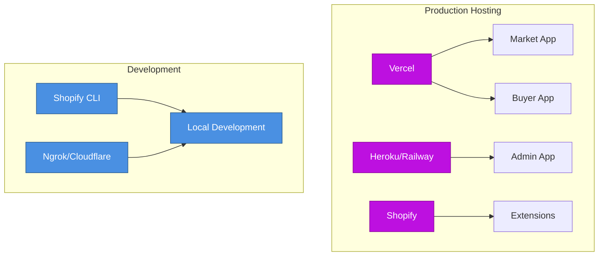

### CI/CD Pipeline
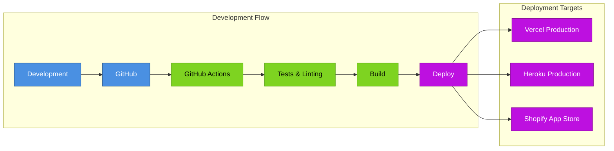

## 📡 External Services & APIs

### Service Integration Map
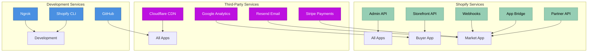

## 🔧 Configuration Management

### Environment Configuration
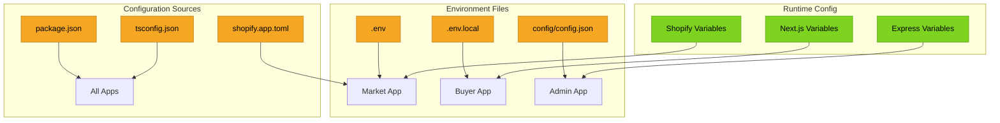

## 📊 Performance & Monitoring

### Performance Stack
- **Monitoring**: Shopify App Performance Dashboard
- **Error Tracking**: Remix built-in error boundaries
- **Logging**: Console logging with structured data
- **Caching**: Cloudflare CDN + Browser caching
- **Database**: Connection pooling and query optimization

### Development Experience
- **Hot Reload**: Vite (Market App), Webpack HMR (Admin App), Next.js Fast Refresh (Buyer App)
- **Type Checking**: TypeScript in all applications
- **Code Formatting**: Prettier with ESLint integration
- **Version Control**: Git with conventional commits

---

**Previous:** [← System Overview](./01-system-overview.md) | **Next:** [Market App Architecture →](./03-market-app-architecture.md)