# Market App Architecture

This document details the architecture of the primary Market App, built with Remix framework and serving as the core marketplace application.

## 🏗️ Application Overview

The Market App is the central hub of the Shopify Marketplace ecosystem, built with Remix for full-stack React development. It handles vendor management, product workflows, and marketplace administration.

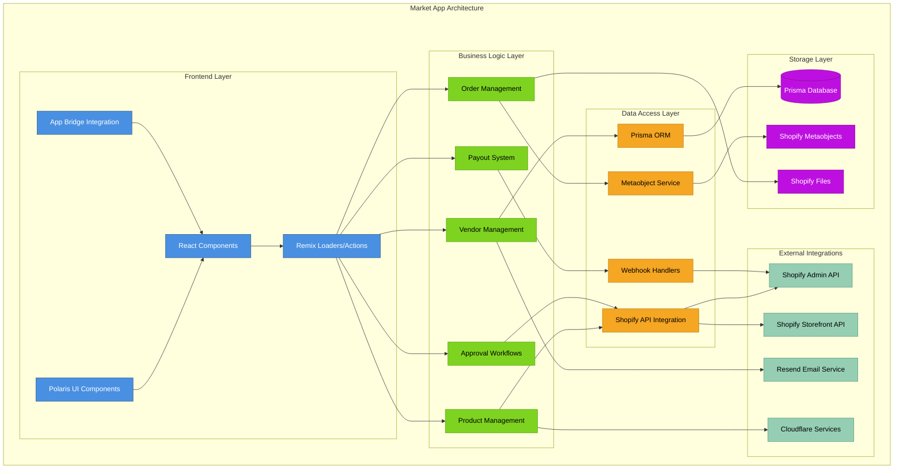

## 📁 Directory Structure

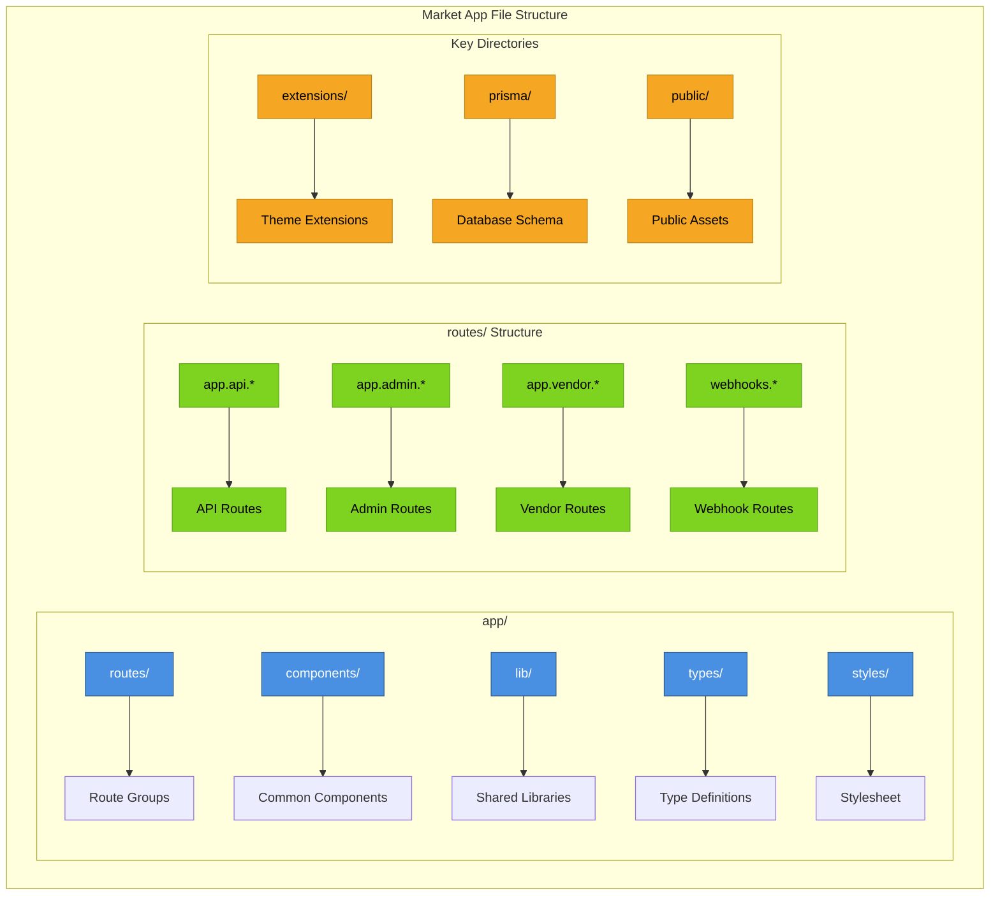

## 🔀 Route Architecture

### Route Organization
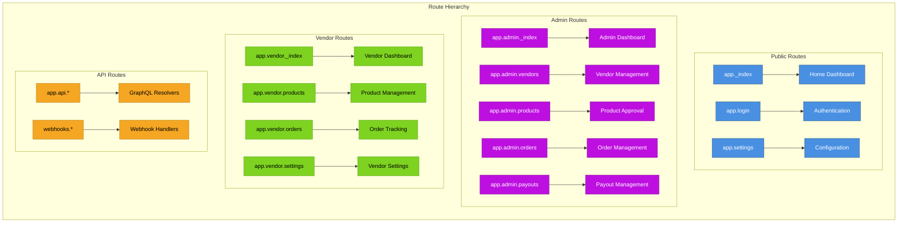

## 🔧 Core Modules

### Vendor Management Module
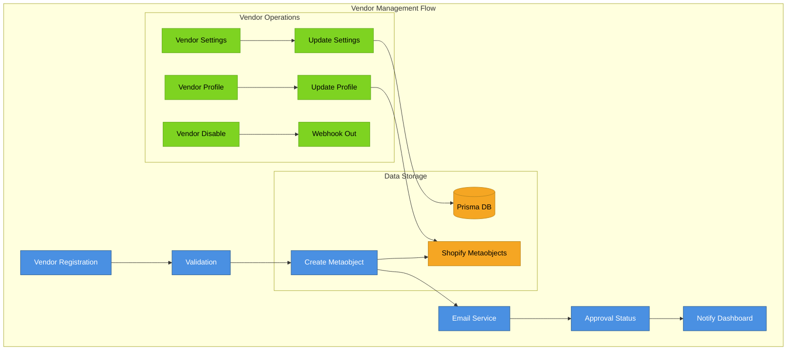

### Product Management Module
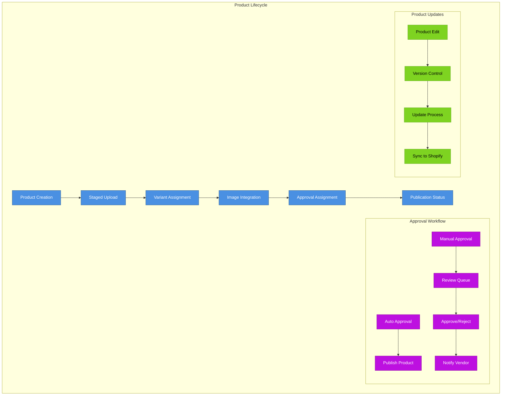

### Order Management Module
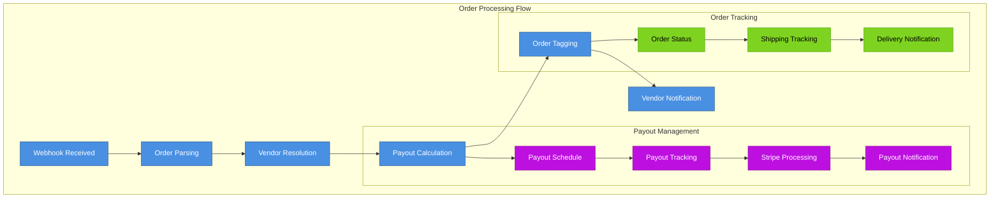

## 🗄️ Data Models

### Prisma Schema Structure
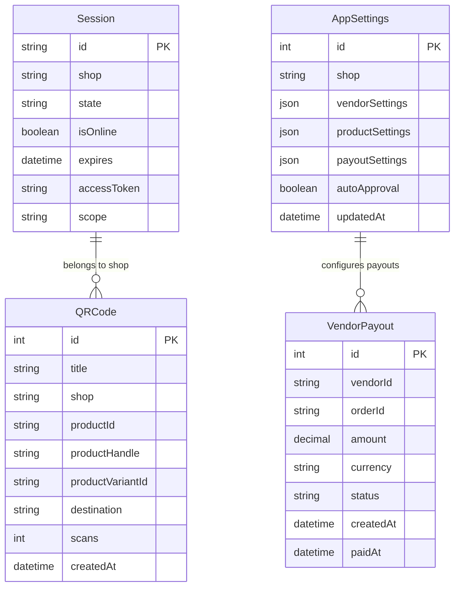

### Metaobject Schema (Shopify)
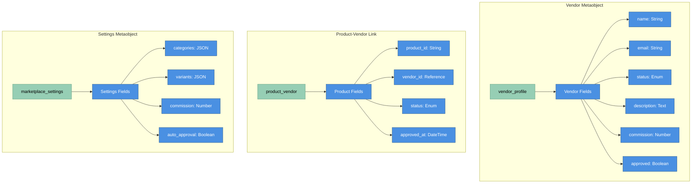

## 🔌 API Integration Layer

### Shopify API Integration
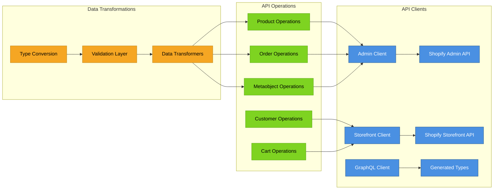

### Webhook System
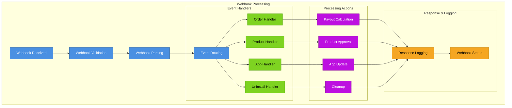

## 🎨 Theme Extensions

### Extension Architecture
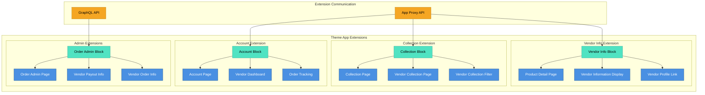

## 🔐 Authentication & Authorization

### Authentication Flow
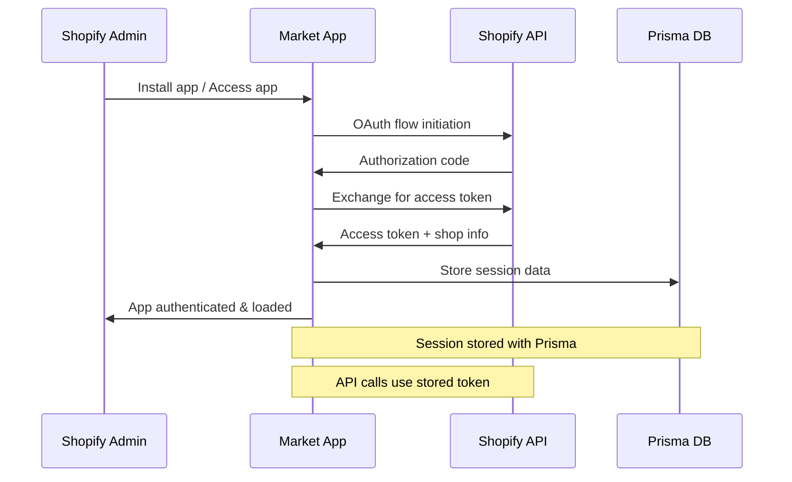

### Authorization Layers
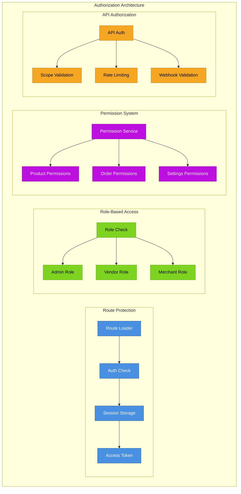

## 🚀 Performance Optimizations

### Remix Performance Features
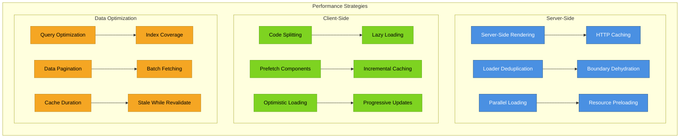

## 📊 Monitoring & Observability

### Application Monitoring
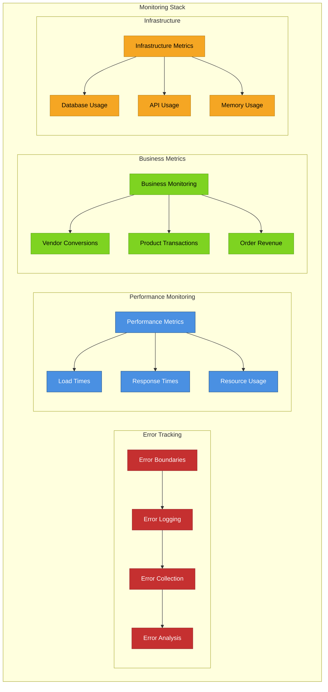

---

**Previous:** [← Technology Stack](./02-technology-stack.md) | **Next:** [Admin App Architecture →](./04-admin-app-architecture.md)