# Admin App Architecture

This document details the architecture of the legacy Admin App, built with Express.js and React, serving as the channel management and administrative interface.

## 🏗️ Application Overview

The Admin App is a legacy Express.js application with React frontend that provides channel management functionality and administrative tools for the marketplace. It uses a traditional MPA (Multi-Page Application) architecture with server-side rendering.

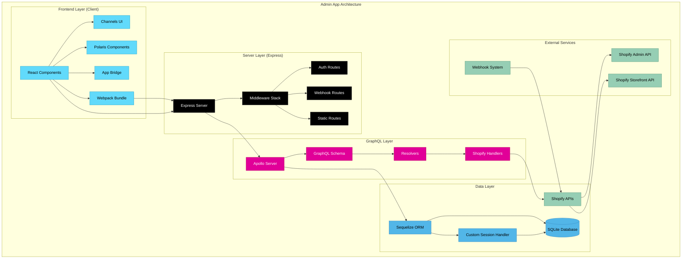

## 📁 Directory Structure

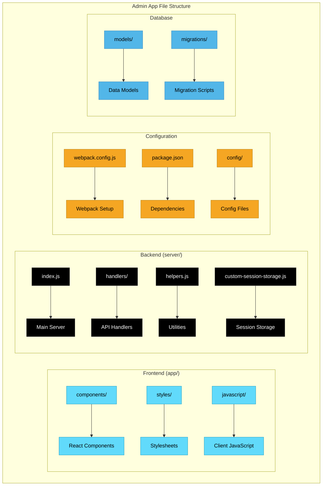

## 🛠️ Express Server Architecture

### Server Setup & Middleware Stack
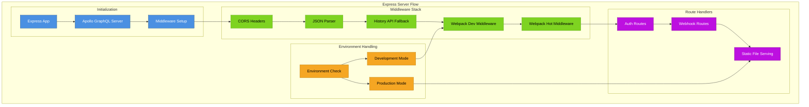

### Authentication Flow
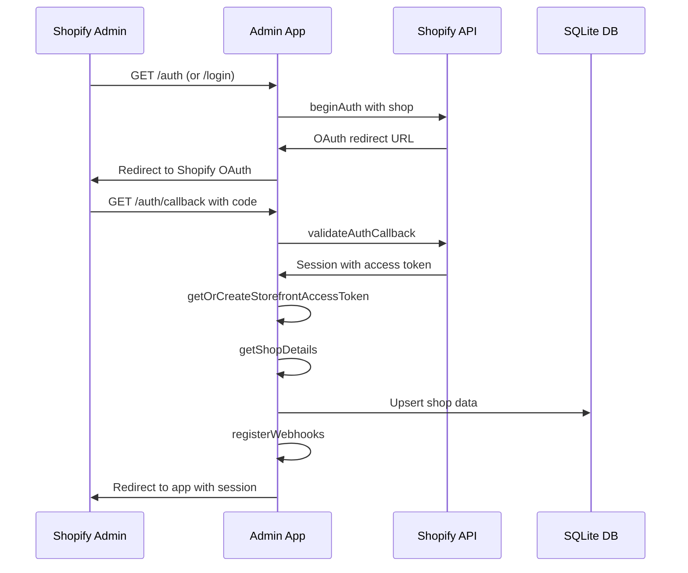

## 🔌 GraphQL Server Architecture

### Apollo Server Setup
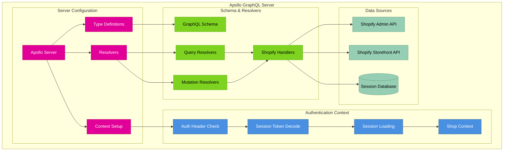

### GraphQL Schema Structure
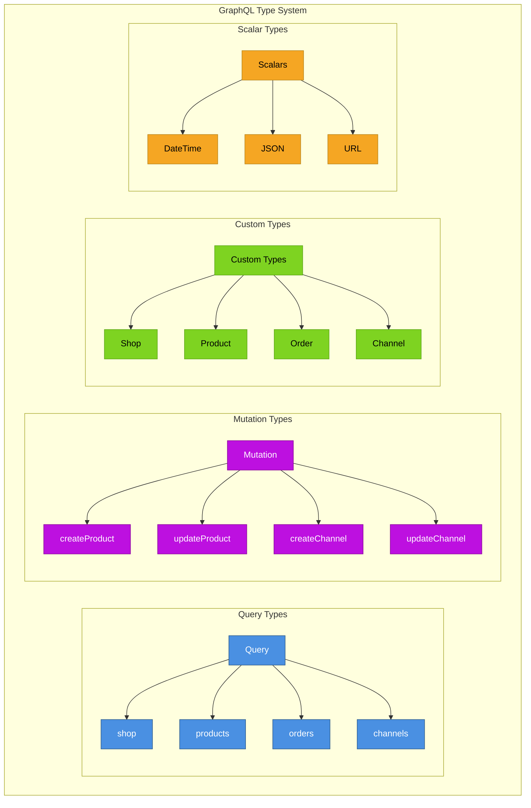

## 🗄️ Database Architecture

### Sequelize ORM Models
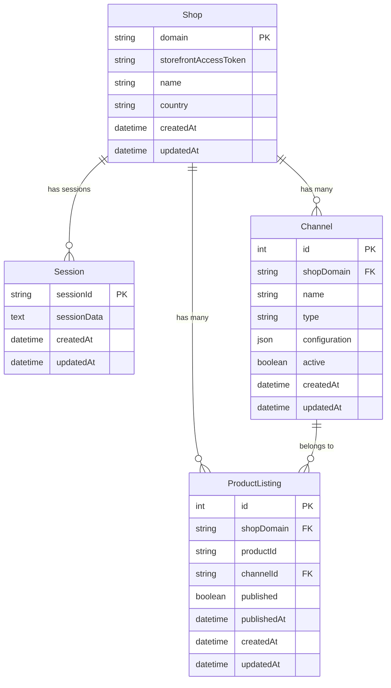

### Custom Session Storage
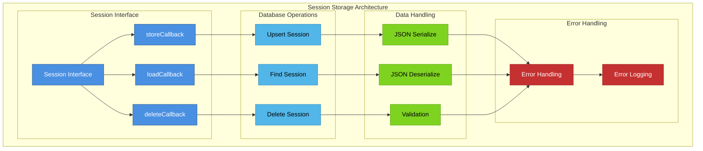

## 🎨 Frontend Architecture

### React Component Structure
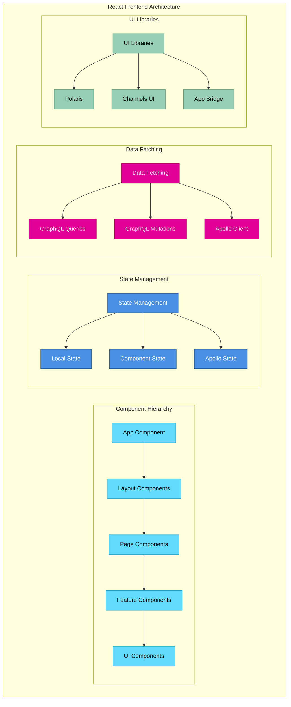

### Webpack Configuration
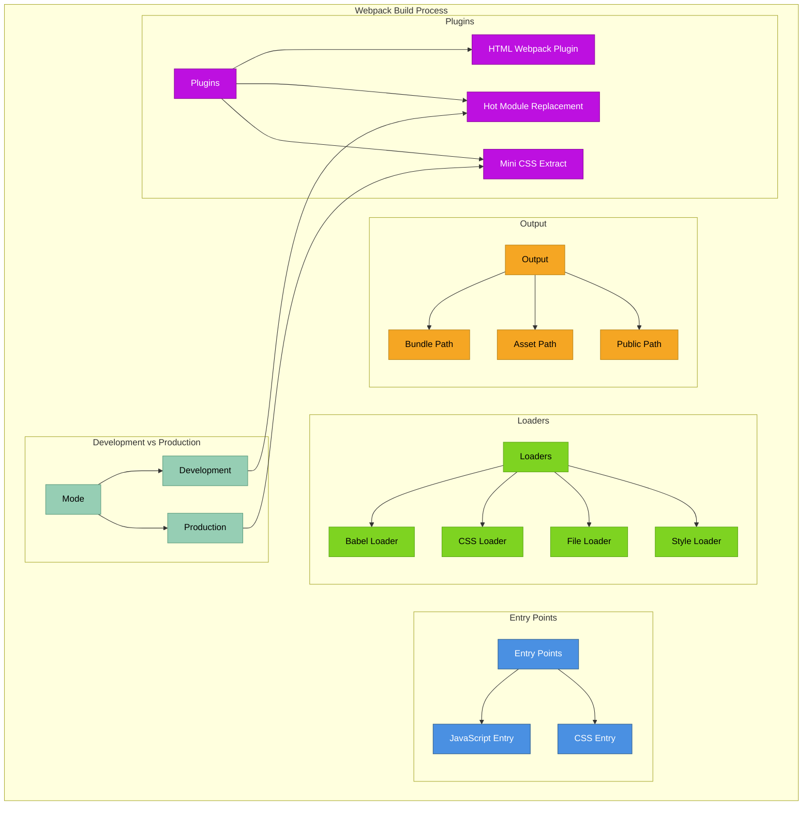

## 🔗 API Integration Layer

### Shopify API Handlers
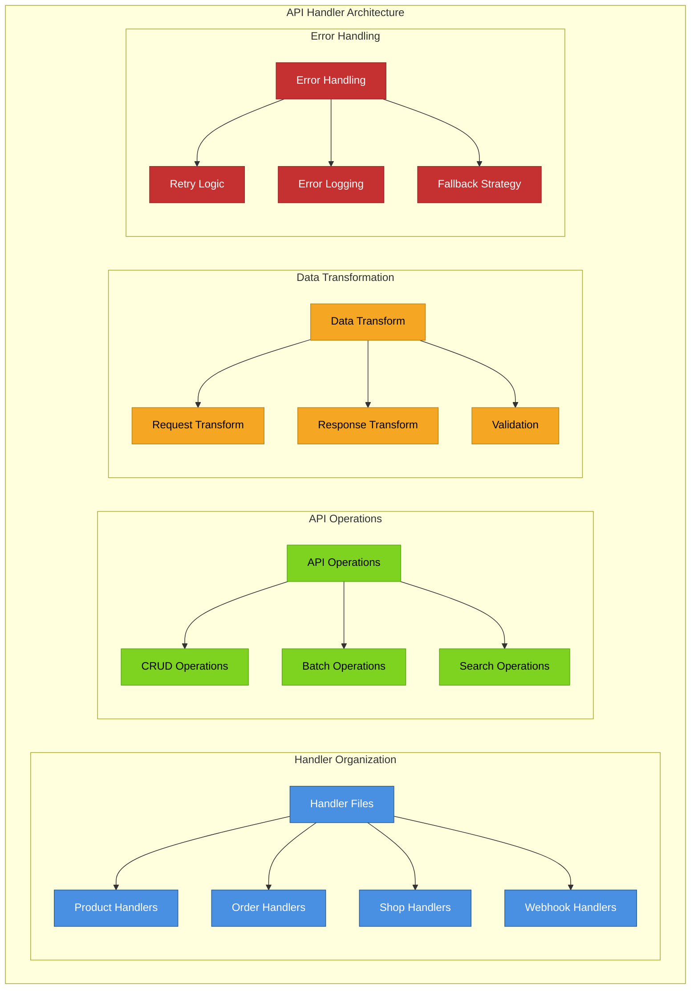

### Webhook System
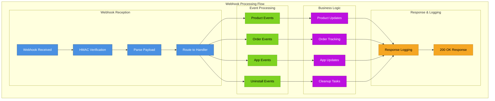

## 🔧 Helper Functions & Utilities

### Helper System Architecture
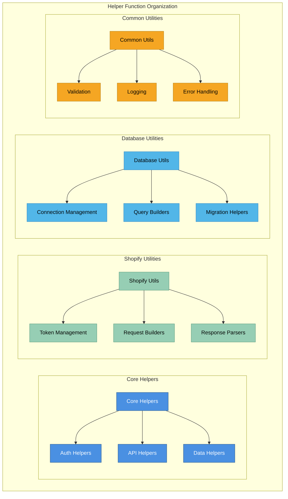

## 🚀 Development & Build Process

### Development Workflow
```mermaid
graph LR
    subgraph "Development Process"
        subgraph "Local Development"
            CLI[Shopify CLI] --> TUNNEL[Tunnel Setup]
            TUNNEL --> DEV[Dev Server]
            DEV --> HMR[Hot Module Reload]
        end
        
        subgraph "Build Process"
            BP[Build Process] --> BABEL[Babel Transpilation]
            BABEL --> WEBPACK[Webpack Bundling]
            WEBPACK --> MINIFY[Minification]
        end
        
        subgraph "Database Setup"
            DB[Database Setup] --> MIGR[Run Migrations]
            MIGR --> SEED[Seed Data]
            SEED --> CONN[Test Connection]
        end
        
        subgraph "Environment Config"
            ENV[Environment] --> VARS[Environment Variables]
            VARS --> SCOPES[Shopify Scopes]
            SCOPES --> HOOKS[Webhook URLs]
        end
    end
    
    classDef dev fill:#4A90E2,stroke:#2E5C8A,color:#fff
    classDef build fill:#7ED321,stroke:#5BA517,color:#000
    classDef database fill:#52B6E8,stroke:#3A8BC4,color:#000
    classDef environment fill:#F5A623,stroke:#B8841A,color:#000
    
    class CLI,TUNNEL,DEV,HMR dev
    class BP,BABEL,WEBPACK,MINIFY build
    class DB,MIGR,SEED,CONN database
    class ENV,VARS,SCOPES,HOOKS environment
```

## 📊 Legacy Considerations

### Migration Strategy
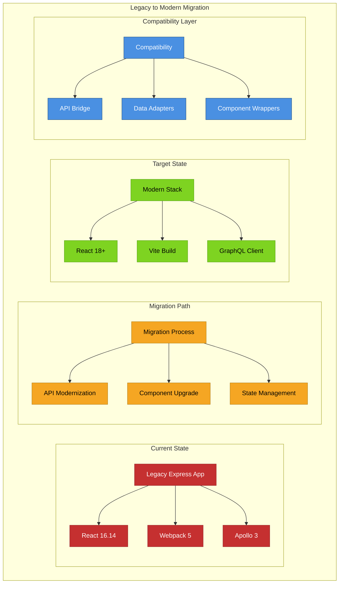

## 🔍 Performance & Optimization

### Performance Strategy
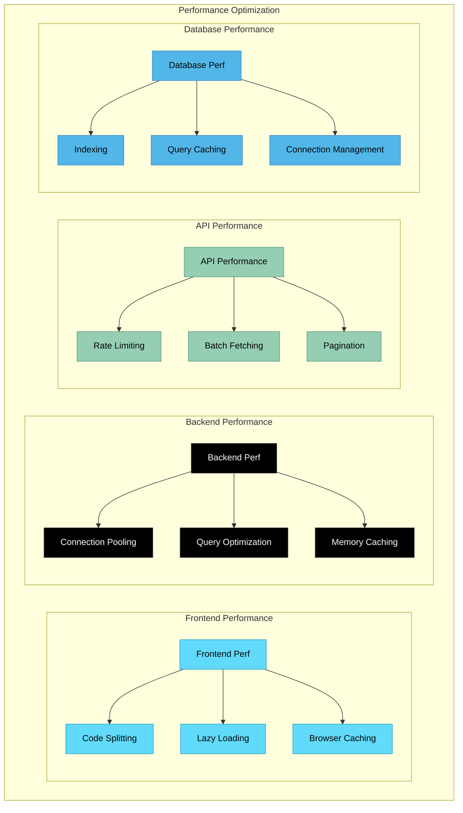

---

**Previous:** [← Market App Architecture](./03-market-app-architecture.md) | **Next:** [Buyer App Architecture →](./05-buyer-app-architecture.md)