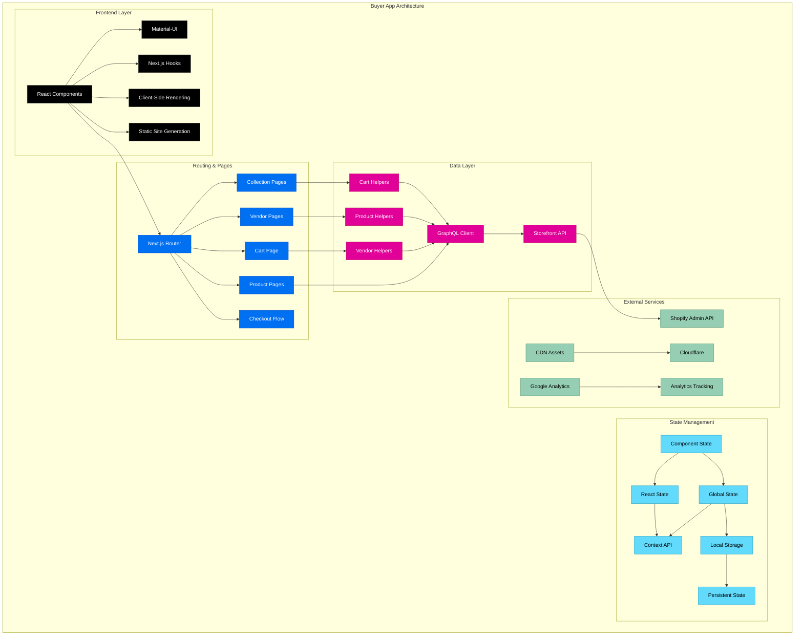
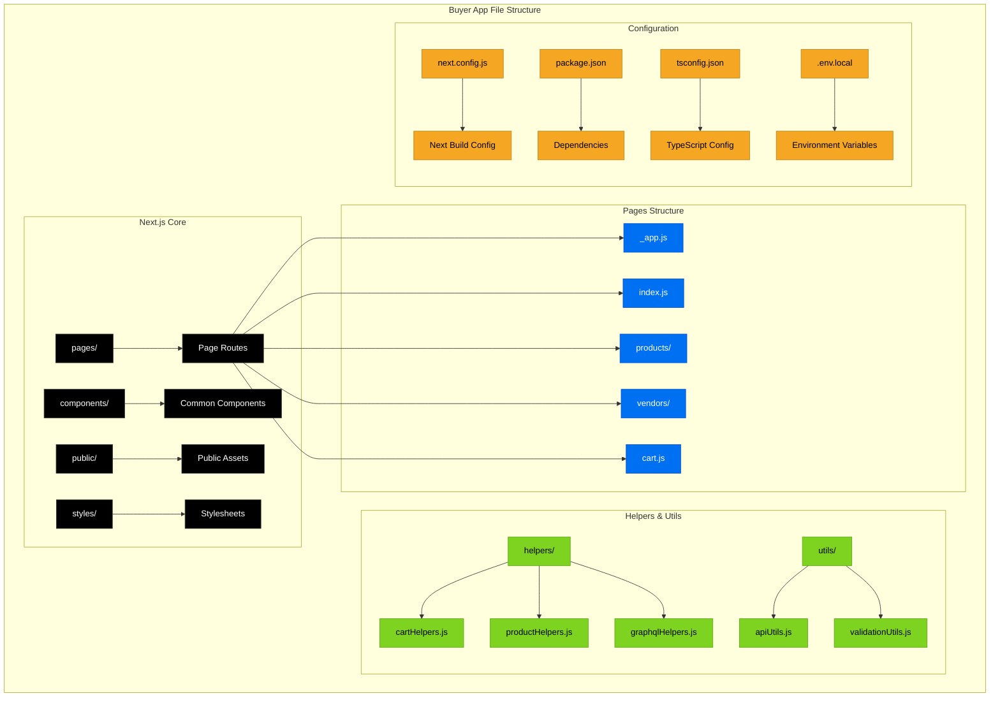
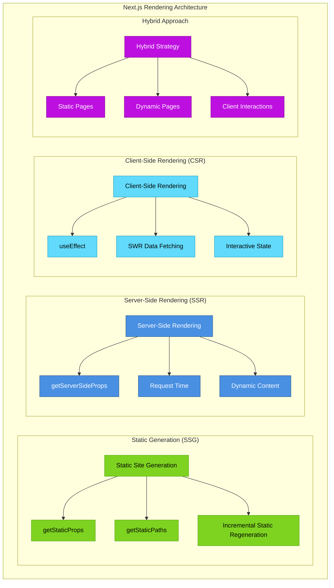
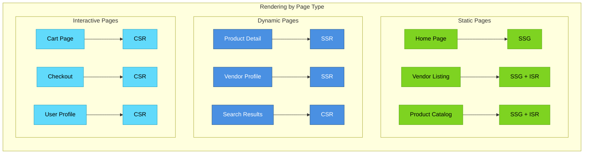
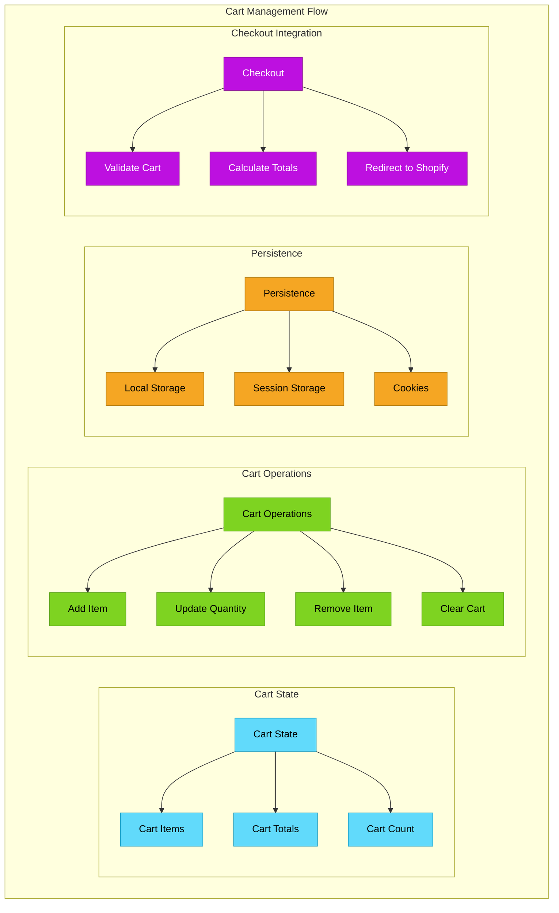
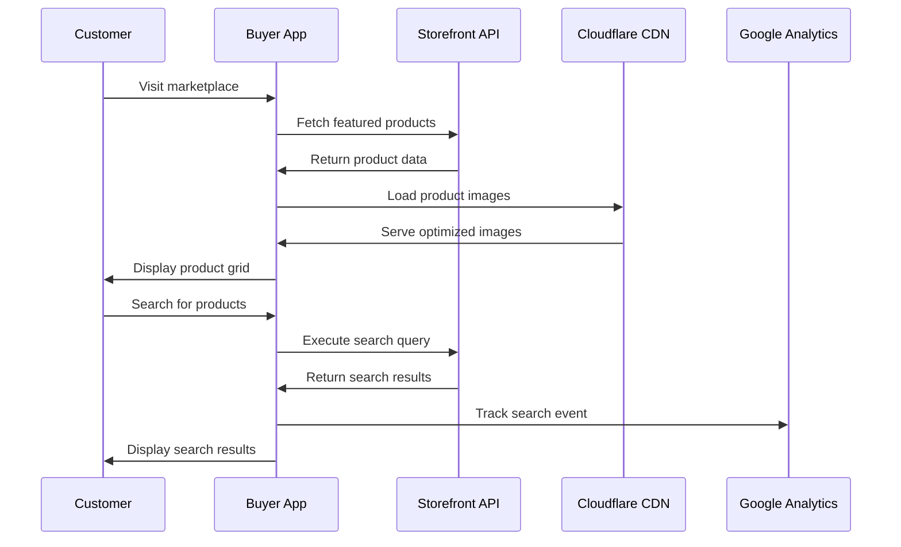
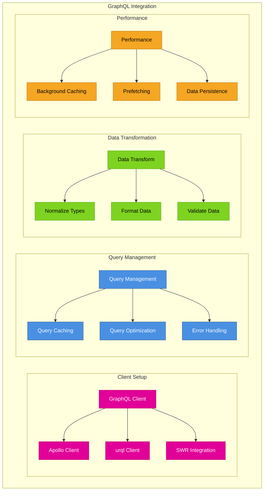

# Buyer App Architecture

This document details the architecture of the Buyer App, built with Next.js, serving as the customer-facing marketplace frontend for browsing and purchasing products.

## 🏗️ Application Overview

The Buyer App is a Next.js application that provides the customer-facing marketplace experience. It handles product browsing, vendor discovery, shopping cart, and checkout functionality using Shopify's Storefront API.



## 📁 Directory Structure



## 🔄 Next.js Rendering Strategy

### Rendering Methods


### Page-Specific Rendering


## 🛒 E-commerce Flow Architecture

### Shopping Cart System


### Product Discovery Flow


## 🔌 Data Integration Layer

### GraphQL Client Architecture


### Shopify Storefront API Integration
```mermaid
graph TB
    subgraph "Storefront API Operations"
        subgraph "Product Operations"
            PO[Product Operations] --> GP[Get Products]
            PO --> GPD[Get Product Details]
            PO --> GV[Get Variants]
            PO --> GI[Get Images]
        end
        
        subgraph "Collection Operations"
            CO3[Collection Operations] --> GC2[Get Collections]
            CO3 --> GCP[Get Collection Products]
            CO3 --> GCM[Get Collection Metadata]
        end
        
        subgraph "Customer Operations"
            CUST[Customer Operations] --> CR[Customer Registration]
            CUST → CL[Customer Login]
            CUST → CO4[Customer Orders]
        end
        
        subgraph "Checkout Operations"
            CHO[Checkout Operations] → CC3[Create Checkout]
            CHO → UC[Update Checkout]
            CHO → GCU[Get Checkout URL]
        end
    end
    
    classDef product fill:#4A90E2,stroke:#2E5C8A,color:#fff
    classDef collection fill:#7ED321,stroke:#5BA517,color:#000
    classDef customer fill:#BD10E0,stroke:#8B0A99,color:#fff
    classDef checkout fill:#F5A623,stroke:#B8841A,color:#000
    
    class PO,GP,GPD,GV,GI product
    class CO3,GC2,GCP,GCM collection
    class CUST,CR,CL,CO4 customer
    class CHO,CC3,UC,GCU checkout
```

## 🎨 UI Components Architecture

### Material-UI Integration
```mermaid
graph TB
    subgraph "Material-UI Component Architecture"
        subgraph "Layout Components"
            LC[Layout Components] --> APP2[AppBar]
            LC --> DR[Drawer]
            LC --> GRID[Grid System]
            LC --> CONT[Container]
        end
        
        subgraph "Product Components"
            PC2[Product Components] --> CARD[Product Card]
            PC2 --> LIST[Product List]
            PC2 --> DET[Product Details]
            PC2 --> GAL[Image Gallery]
        end
        
        subgraph "Form Components"
            FC[Form Components] → TF[Text Fields]
            FC → SEL[Select Dropdowns]
            FC → BTN[Buttons]
            FC → CHK[Checkboxes]
        end
        
        subgraph "Navigation Components"
            NC2[Navigation Components] → MENU[Menu]
            NC2 → BREAD[Breadcrumbs]
            NC2 → TAB[Tabs]
            NC2 → PAG[Pagination]
        end
    end
    
    classDef layout fill:#007FFF,stroke:#0056CC,color:#fff
    classDef product fill:#4A90E2,stroke:#2E5C8A,color:#fff
    classDef form fill:#7ED321,stroke:#5BA517,color:#000
    classDef navigation fill:#BD10E0,stroke:#8B0A99,color:#fff
    
    class LC,APP2,DR,GRID,CONT layout
    class PC2,CARD,LIST,DET,GAL product
    class FC,TF,SEL,BTN,CHK form
    class NC2,MENU,BREAD,TAB,PAG navigation
```

### Custom Component System
```mermaid
graph TB
    subgraph "Custom Component Hierarchy"
        subgraph "Base Components"
            BC[Base Components] --> BT[Base Typography]
            BC --> BB[Base Buttons]
            BC → BI[Base Inputs]
            BC → BL[Base Layouts]
        end
        
        subgraph "Composite Components"
            CC3[Composite Components] → PG[Product Grid]
            CC3 → VL[Vendor List]
            CC3 → SC[Search Component]
            CC3 → FC2[Filter Component]
        end
        
        subgraph "Page Components"
            PC3[Page Components] → HP2[Home Page]
            PC3 → PP3[Product Page]
            PC3 → VP3[Vendor Page]
            PC3 → CP3[Cart Page]
        end
        
        subgraph "Feature Components"
            FEC[Feature Components] → SH[Shopping Helper]
            FEC → WL[Wishlist]
            FEC → REV[Reviews]
            FEC → REC[Recommendations]
        end
    end
    
    classDef base fill:#4A90E2,stroke:#2E5C8A,color:#fff
    classDef composite fill:#7ED321,stroke:#5BA517,color:#000
    classDef page fill:#BD10E0,stroke:#8B0A99,color:#fff
    classDef feature fill:#F5A623,stroke:#B8841A,color:#000
    
    class BC,BT,BB,BI,BL base
    class CC3,PG,VL,SC,FC2 composite
    class PC3,HP2,PP3,VP3,CP3 page
    class FEC,SH,WL,REV,REC feature
```

## 🔍 Search & Discovery

### Search Architecture
```mermaid
graph TB
    subgraph "Search System Architecture"
        subgraph "Search Interface"
            SI2[Search Interface] → SB[Search Bar]
            SI2 → SF[Search Filters]
            SI2 → SS2[Search Suggestions]
            SI2 → SR[Search Results]
        end
        
        subgraph "Search Logic"
            SL[Search Logic] → QP[Query Processing]
            SL → QV[Query Validation]
            SL → QB[Query Building]
            SL → QE[Query Execution]
        end
        
        subgraph "Filter System"
            FS[Filter System] → PF[Price Filter]
            FS → CF2[Category Filter]
            FS → VF[Vendor Filter]
            FS → AF[Availability Filter]
        end
        
        subgraph "Result Processing"
            RP[Result Processing] → RS[Result Sorting]
            RP → RF[Result Filtering]
            RP → RP2[Result Pagination]
            RP → RR[Result Ranking]
        end
    end
    
    classDef interface fill:#4A90E2,stroke:#2E5C8A,color:#fff
    classDef logic fill:#7ED321,stroke:#5BA517,color:#000
    classDef filter fill:#BD10E0,stroke:#8B0A99,color:#fff
    classDef processing fill:#F5A623,stroke:#B8841A,color:#000
    
    class SI2,SB,SF,SS2,SR interface
    class SL,QP,QV,QB,QE logic
    class FS,PF,CF2,VF,AF filter
    class RP,RS,RF,RP2,RR processing
```

## 🛡️ Security & Performance

### Security Implementation
```mermaid
graph TB
    subgraph "Security Architecture"
        subgraph "Input Validation"
            IV[Input Validation] → XV[XSS Prevention]
            IV → SV[SQL Injection Prevention]
            IV → IV2[Input Sanitization]
        end
        
        subgraph "Authentication"
            AUTH2[Authentication] → JT[JWT Tokens]
            AUTH2 → OA[OAuth Integration]
            AUTH2 → SS3[Session Security]
        end
        
        subgraph "Data Protection"
            DP2[Data Protection] → ENC[Encryption]
            DP2 → HTTPS[HTTPS Enforcement]
            DP2 → CSP[Content Security Policy]
        end
        
        subgraph "API Security"
            AS2[API Security] → RT2[Rate Throttling]
            AS2 → AK[API Key Management]
            AS2 → CORS2[CORS Configuration]
        end
    end
    
    classDef validation fill:#4A90E2,stroke:#2E5C8A,color:#fff
    classDef auth fill:#7ED321,stroke:#5BA517,color:#000
    classDef protection fill:#C53030,stroke:#9B2C2C,color:#fff
    classDef api fill:#F5A623,stroke:#B8841A,color:#000
    
    class IV,XV,SV,IV2 validation
    class AUTH2,JT,OA,SS3 auth
    class DP2,ENC,HTTPS,CSP protection
    class AS2,RT2,AK,CORS2 api
```

### Performance Optimization
```mermaid
graph TB
    subgraph "Performance Optimization Strategy"
        subgraph "Loading Optimization"
            LO[Loading Optimization] → LL2[Lazy Loading]
            LO → IC2[Image Compression]
            LO → CS3[Code Splitting]
            LO → PL2[Preloading]
        end
        
        subgraph "Caching Strategy"
            CS4[Caching Strategy] → BC2[Browser Caching]
            CS4 → CDN2[CDN Caching]
            CS4 → QC2[Query Caching]
            CS4 → SC2[Static Caching]
        end
        
        subgraph "Bundle Optimization"
            BO[Bundle Optimization] → TS2[Tree Shaking]
            BO → MIN[Minification]
            BO → GZ[Gzip Compression]
            BO → DI[Dynamic Imports]
        end
        
        subgraph "Runtime Performance"
            RTP[Runtime Performance] → RM[React Memoization]
            RTP → VC[Virtual Scrolling]
            RTP → DB[Debouncing]
            RTP → TH[Throttling]
        end
    end
    
    classDef loading fill:#4A90E2,stroke:#2E5C8A,color:#fff
    classDef caching fill:#7ED321,stroke:#5BA517,color:#000
    classDef bundle fill:#BD10E0,stroke:#8B0A99,color:#fff
    classDef runtime fill:#F5A623,stroke:#B8841A,color:#000
    
    class LO,LL2,IC2,CS3,PL2 loading
    class CS4,BC2,CDN2,QC2,SC2 caching
    class BO,TS2,MIN,GZ,DI bundle
    class RTP,RM,VC,DB,TH runtime
```

## 📱 Responsive Design

### Responsive Architecture
```mermaid
graph TB
    subgraph "Responsive Design System"
        subgraph "Breakpoint System"
            BS[Breakpoint System] → XS[Extra Small (0px)]
            BS → SM[Small (600px)]
            BS → MD[Medium (960px)]
            BS → LG[Large (1280px)]
            BS → XL[Extra Large (1920px)]
        end
        
        subgraph "Layout Strategies"
            LS2[Layout Strategies] → FG[Flexbox Grid]
            LS2 → CG[CSS Grid]
            LS2 → MG[Material Grid]
            LS2 → RL[Responsive Layout]
        end
        
        subgraph "Component Adaptation"
            CA[Component Adaptation] → RN[Responsive Navigation]
            CA → RT3[Responsive Tables]
            CA → RI[Responsive Images]
            CA → RF2[Responsive Forms]
        end
        
        subgraph "Mobile Optimization"
            MO2[Mobile Optimization] → TF2[Touch Friendly]
            MO2 → MS[Mobile Speed]
            MO2 → MW[Mobile Workflow]
            MO2 → PW[Progressive Web App]
        end
    end
    
    classDef breakpoint fill:#4A90E2,stroke:#2E5C8A,color:#fff
    classDef layout fill:#7ED321,stroke:#5BA517,color:#000
    classDef component fill:#BD10E0,stroke:#8B0A99,color:#fff
    classDef mobile fill:#F5A623,stroke:#B8841A,color:#000
    
    class BS,XS,SM,MD,LG,XL breakpoint
    class LS2,FG,CG,MG,RL layout
    class CA,RN,RT3,RI,RF2 component
    class MO2,TF2,MS,MW,PW mobile
```

## 🚀 Deployment & Build Process

### Build Pipeline
```mermaid
graph LR
    subgraph "Next.js Build Process"
        subgraph "Development"
            DEV2[Development] → HS[Hot Swapping]
            DEV2 → FR[Fast Refresh]
            DEV2 → EM[Error Messages]
        end
        
        subgraph "Build Stage"
            BUILD2[Build Process] → OPT[Optimization]
            BUILD2 → SSG4[Static Generation]
            BUILD2 → BA[Bundle Analysis]
        end
        
        subgraph "Deployment"
            DEPLOY2[Deployment] → VERCEL[Vercel Deploy]
            DEPLOY2 → CDN3[CDN Distribution]
            DEPLOY2 → ENV2[Environment Config]
        end
        
        subgraph "Monitoring"
            MON[Monitoring] → PERF2[Performance Metrics]
            MON → ERR[Error Tracking]
            MON → UX[User Experience]
        end
    end
    
    classDef development fill:#4A90E2,stroke:#2E5C8A,color:#fff
    classDef build fill:#7ED321,stroke:#5BA517,color:#000
    classDef deployment fill:#BD10E0,stroke:#8B0A99,color:#fff
    classDef monitoring fill:#F5A623,stroke:#B8841A,color:#000
    
    class DEV2,HS,FR,EM development
    class BUILD2,OPT,SSG4,BA build
    class DEPLOY2,VERCEL,CDN3,ENV2 deployment
    class MON,PERF2,ERR,UX monitoring
```

## 📊 Analytics & Tracking

### Analytics Architecture
```mermaid
graph TB
    subgraph "Analytics & Tracking System"
        subgraph "Event Tracking"
            ET[Event Tracking] → PV[Page Views]
            ET → PE[Product Events]
            ET → CE[Cart Events]
            ET → SE[Search Events]
        end
        
        subgraph "User Analytics"
            UA[User Analytics] → UJ[User Journey]
            UA → UB[User Behavior]
            UA → UC2[User Conversion]
            UA → UR[User Retention]
        end
        
        subgraph "Business Metrics"
            BM2[Business Metrics] → RV[Revenue Tracking]
            BM2 → CR2[Conversion Rate]
            BM2 → AOV[Average Order Value]
            BM2 → CTR[Click Through Rate]
        end
        
        subgraph "Performance Tracking"
            PT2[Performance Tracking] → LT2[Load Times]
            PT2 → IN[Interaction Time]
            PT2 → ER2[Error Rates]
            PT2 → UP[User Performance]
        end
    end
    
    classDef event fill:#4A90E2,stroke:#2E5C8A,color:#fff
    classDef user fill:#7ED321,stroke:#5BA517,color:#000
    classDef business fill:#BD10E0,stroke:#8B0A99,color:#fff
    classDef performance fill:#F5A623,stroke:#B8841A,color:#000
    
    class ET,PV,PE,CE,SE event
    class UA,UJ,UB,UC2,UR user
    class BM2,RV,CR2,AOV,CTR business
    class PT2,LT2,IN,ER2,UP performance
```

---

**Previous:** [← Admin App Architecture](./04-admin-app-architecture.md) | **Next:** [API Integrations →](./06-api-integrations.md)