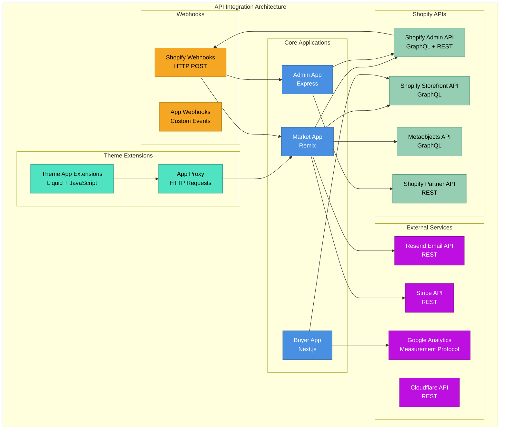
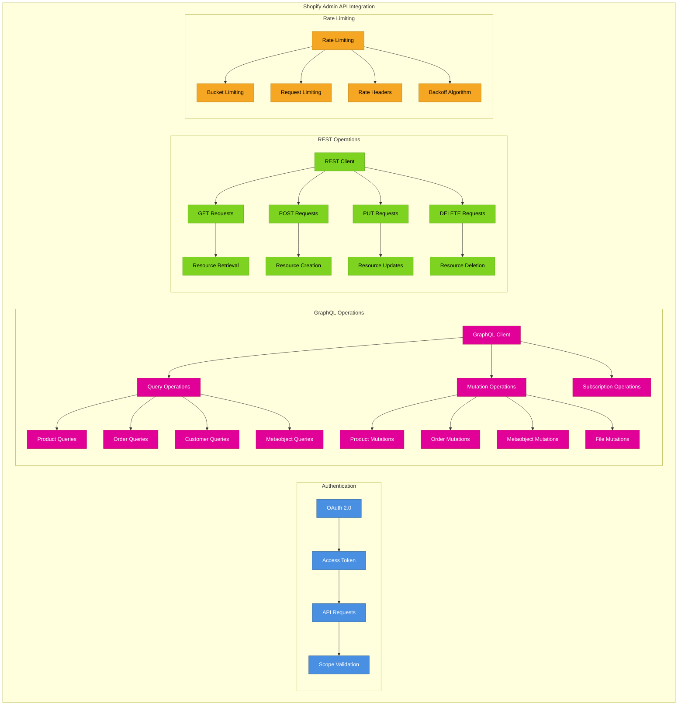
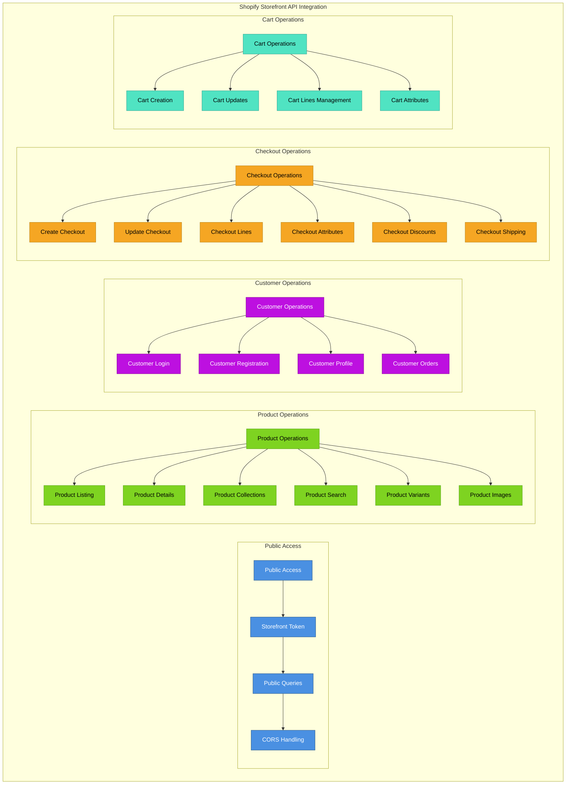
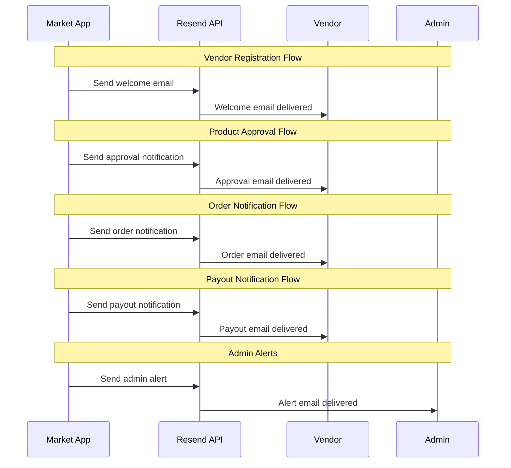
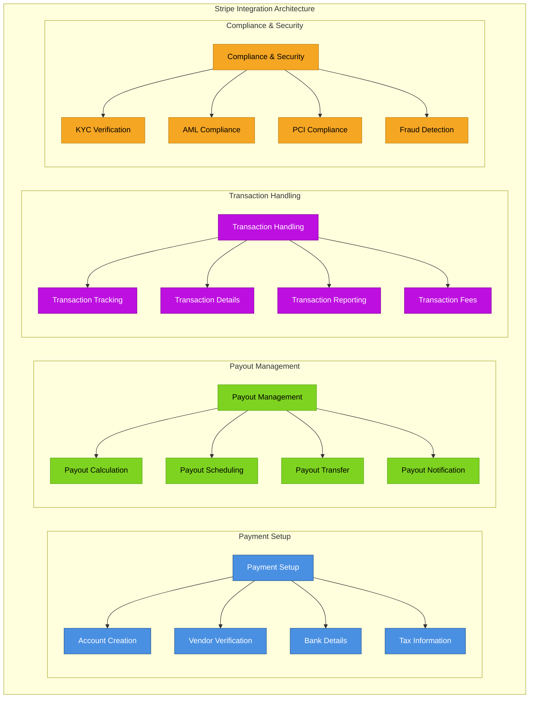
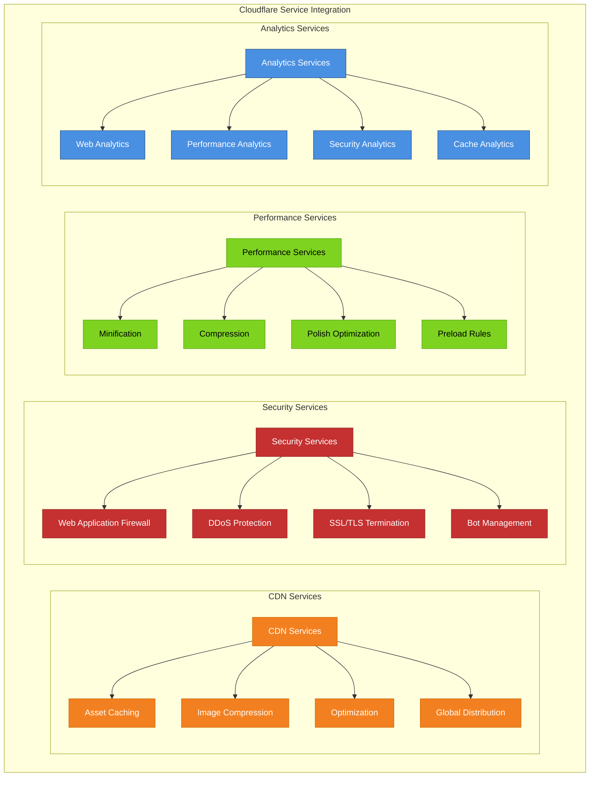
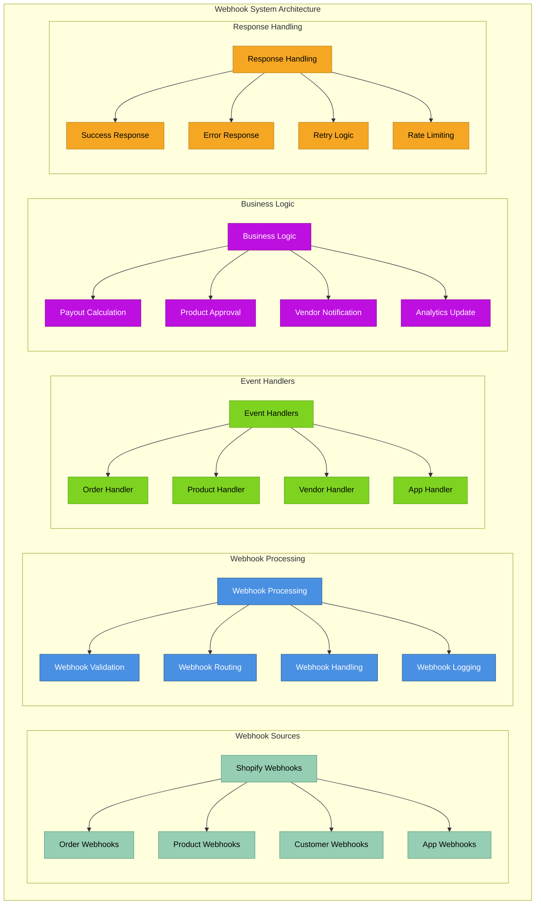
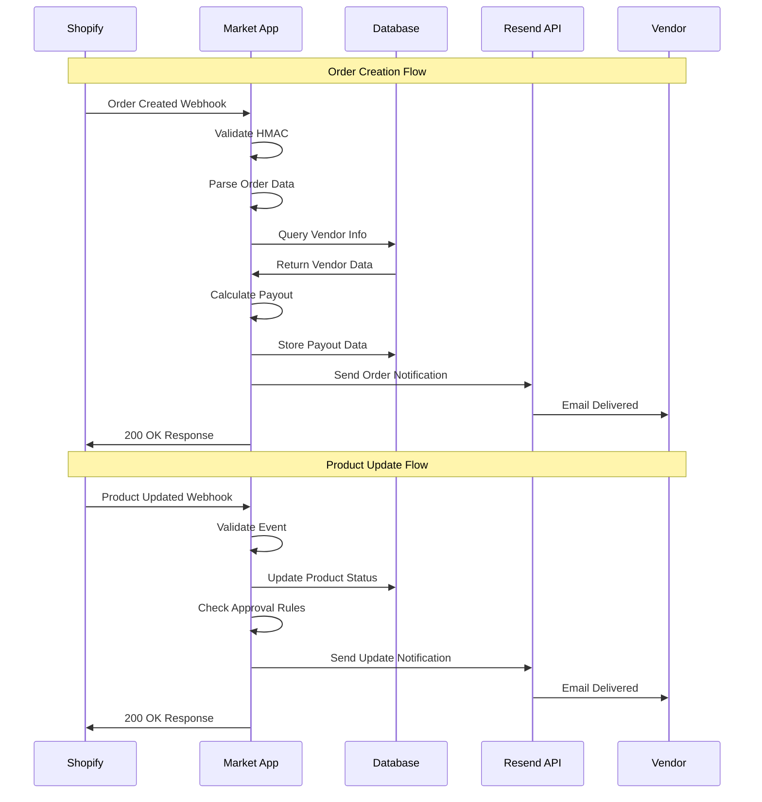
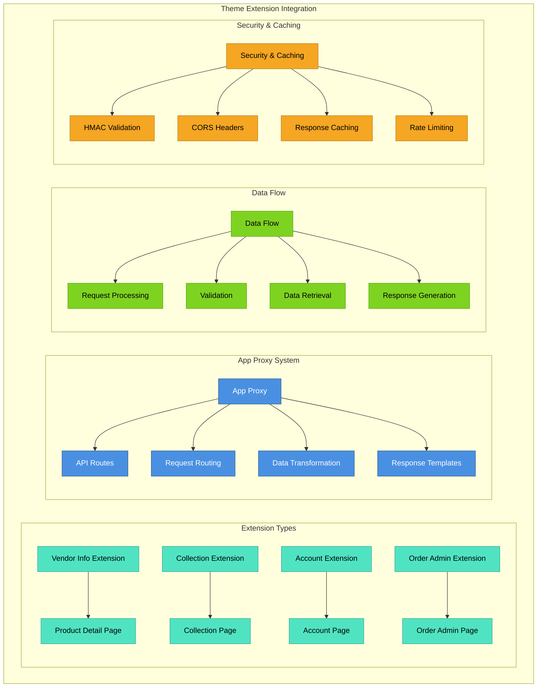
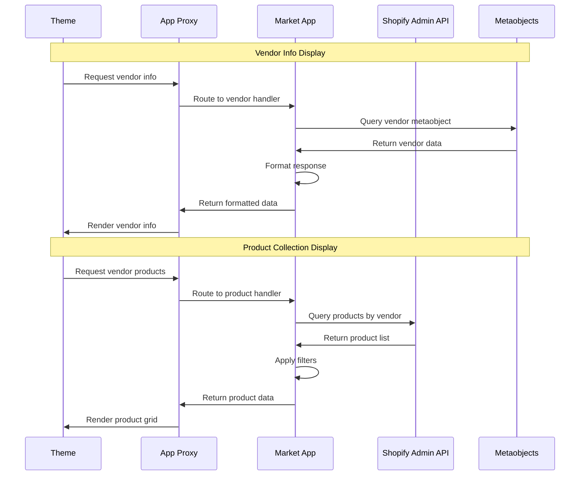

# API Integrations

This document details the comprehensive API integration strategy across all applications in the Shopify Marketplace ecosystem, including Shopify APIs, external services, and inter-app communication.

## 🔌 API Integration Overview



## 🛍️ Shopify API Integration

### Admin API Integration


### Storefront API Integration


### Metaobjects API Strategy
```mermaid
graph TB
    subgraph "Metaobjects API Integration"
        subgraph "Vendor Management"
            VM[Vendor Metaobjects] --> VC[Vendor Creation]
            VM --> VU[Vendor Updates]
            VM --> VQ[Vendor Queries]
            VM --> VD[Vendor Deletion]
        end
        
        subgraph "Product-Vendor Links"
            PVL[Product-Vendor Links] --> PVC[Create Links]
            PVL --> PVU[Update Links]
            PVL --> PVQ[Query Links]
            PVL --> PVR[Remove Links]
        end
        
        subgraph "Settings Management"
            SM[Settings Metaobjects] --> SC2[Settings Creation]
            SM --> SU[Settings Updates]
            SM --> SQ[Settings Queries]
            SM --> SV[Settings Validation]
        end
        
        subgraph "Approval Workflow"
            AW[Approval Workflow] --> AS[Approval Status]
            AW --> AT2[Approval Tracking]
            AW --> AN[Approval Notifications]
            AW --> AH[Approval History]
        end
        
        subgraph "Bulk Operations"
            BO[Bulk Operations] --> BCO[Bulk Create]
            BO --> BUO[Bulk Update]
            BO → BDO[Bulk Delete]
            BO → BQO[Bulk Query]
        end
    end
    
    classDef vendor fill:#4A90E2,stroke:#2E5C8A,color:#fff
    classDef productlink fill:#7ED321,stroke:#5BA517,color:#000
    classDef settings fill:#BD10E0,stroke:#8B0A99,color:#fff
    classDef approval fill:#F5A623,stroke:#B8841A,color:#000
    classDef bulk fill:#50E3C2,stroke:#38A594,color:#000
    
    class VM,VC,VU,VQ,VD vendor
    class PVL,PVC,PVU,PVQ,PVR productlink
    class SM,SC2,SU,SQ,SV settings
    class AW,AS,AT2,AN,AH approval
    class BO,BCO,BUO,BDO,BQO bulk
```

## 📧 External Service Integrations

### Email Service (Resend API)


### Payment Processing (Stripe API)


### Cloudflare Integration


## 🔔 Webhook System

### Webhook Architecture


### Webhook Event Flow


## 🔗 Theme Extension Integration

### App Proxy Architecture


### Extension Communication Flow


## 📊 API Error Handling & Monitoring

### Error Handling Strategy
```mermaid
graph TB
    subgraph "API Error Handling Architecture"
        subgraph "Error Classification"
            EC[Error Classification] --> CE2[Client Errors (4xx)]
            EC --> SE[Server Errors (5xx)]
            EC --> NE[Network Errors]
            EC --> BE[Business Logic Errors]
        end
        
        subgraph "Error Recovery"
            ER2[Error Recovery] --> RT3[Retry Logic]
            ER2 --> FB[Fallback Strategies]
            ER2 --> CB[Circuit Breaker]
            ER2 --> GD[Graceful Degradation]
        end
        
        subgraph "Error Reporting"
            ERP[Error Reporting] --> EL[Error Logging]
            ERP --> ENM[Error Notifications]
            ERP --> EM[Error Metrics]
            ERP → EA[Error Analytics]
        end
        
        subgraph "Recovery Actions"
            RA[Recovery Actions] --> AR3[Automatic Retry]
            RA → MR[Manual Review]
            RA → CC2[Compensation Logic]
            RA → UC2[User Communication]
        end
    end
    
    classDef classification fill:#4A90E2,stroke:#2E5C8A,color:#fff
    classDef recovery fill:#7ED321,stroke:#5BA517,color:#000
    classDef reporting fill:#BD10E0,stroke:#8B0A99,color:#fff
    classDef actions fill:#F5A623,stroke:#B8841A,color:#000
    
    class EC,CE2,SE,NE,BE classification
    class ER2,RT3,FB,CB,GD recovery
    class ERP,EL,ENM,EM,EA reporting
    class RA,AR3,MR,CC2,UC2 actions
```

### API Monitoring & Analytics
```mermaid
graph TB
    subgraph "API Monitoring System"
        subgraph "Performance Metrics"
            PM2[Performance Metrics] --> RT4[Response Times]
            PM2 --> TH2[Throughput]
            PM2 --> UP[Uptime]
            PM2 --> ER3[Error Rates]
        end
        
        subgraph "Usage Analytics"
            UA2[Usage Analytics] --> AC3[API Call Volume]
            UA2 --> EP[Endpoint Popularity]
            UA2 --> UV[User Volumes]
            UA2 --> GU[Geographic Usage]
        end
        
        subgraph "Business Metrics"
            BM3[Business Metrics] --> VC2[Vendor Conversions]
            BM3 --> PC3[Product Conversions]
            BM3 --> OR[Order Revenue]
            BM3 → SR2[Success Rates]
        end
        
        subgraph "Alerting System"
            AS4[Alerting System] → TA[Threshold Alerts]
            AS4 → AA2[Anomaly Alerts]
            AS4 → CA3[Critical Alerts]
            AS4 → EA2[Escalation Alerts]
        end
    end
    
    classDef performance fill:#4A90E2,stroke:#2E5C8A,color:#fff
    classDef usage fill:#7ED321,stroke:#5BA517,color:#000
    classDef business fill:#BD10E0,stroke:#8B0A99,color:#fff
    classDef alerting fill:#C53030,stroke:#9B2C2C,color:#fff
    
    class PM2,RT4,TH2,UP,ER3 performance
    class UA2,AC3,EP,UV,GU usage
    class BM3,VC2,PC3,OR,SR2 business
    class AS4,TA,AA2,CA3,EA2 alerting
```

## 🔐 API Security & Compliance

### Security Implementation
```mermaid
graph TB
    subgraph "API Security Architecture"
        subgraph "Authentication"
            AUTH3[Authentication] --> OA2[OAuth 2.0]
            AUTH3 --> JWT[JWT Tokens]
            AUTH3 → API[API Keys]
            AUTH3 → HMAC2[HMAC Signatures]
        end
        
        subgraph "Authorization"
            AUTHZ[Authorization] → RBAC[Role-Based Access]
            AUTHZ → SC4[Scope Control]
            AUTHZ → PERM[Permission Checks]
            AUTHZ → POL[Policy Enforcement]
        end
        
        subgraph "Data Protection"
            DP3[Data Protection] → ENC2[Encryption in Transit]
            DP3 → ENCR[Encryption at Rest]
            DP3 → MASK[Data Masking]
            DP3 → ANON[Anonymization]
        end
        
        subgraph "Threat Protection"
            TP[Threat Protection] → RL5[Rate Limiting]
            TP → IDS[Intrusion Detection]
            TP → WAF2[Web Application Firewall]
            TP → BOT2[Bot Protection]
        end
    end
    
    classDef auth fill:#4A90E2,stroke:#2E5C8A,color:#fff
    classDef authz fill:#7ED321,stroke:#5BA517,color:#000
    classDef protection fill:#BD10E0,stroke:#8B0A99,color:#fff
    classDef threat fill:#C53030,stroke:#9B2C2C,color:#fff
    
    class AUTH3,OA2,JWT,API,HMAC2 auth
    class AUTHZ,RBAC,SC4,PERM,POL authz
    class DP3,ENC2,ENCR,MASK,ANON protection
    class TP,RL5,IDS,WAF2,BOT2 threat
```

## 📈 API Performance Optimization

### Performance Strategy
```mermaid
graph TB
    subgraph "API Performance Optimization"
        subgraph "Caching Strategy"
            CS5[Caching Strategy] → RC[Response Caching]
            CS5 → QC3[Query Caching]
            CS5 → DC[Database Caching]
            CS5 → CDN4[CDN Caching]
        end
        
        subgraph "Request Optimization"
            RO[Request Optimization] → BF2[Batch Requests]
            RO → FQ[Field Selection]
            RO → PG2[Pagination]
            RO → COMP[Compression]
        end
        
        subgraph "Response Optimization"
            RO2[Response Optimization] → MIN2[Response Minification]
            RO2 → FIL[Response Filtering]
            RO2 → GZ2[Gzip Compression]
            RO2 → ETG[ETag Headers]
        end
        
        subgraph "Connection Optimization"
            CO5[Connection Optimization] → CP2[Connection Pooling]
            CO5 → KA[Keep-Alive]
            CO5 → MP[Multiplexing]
            CO5 → HTTP2[HTTP/2 Support]
        end
    end
    
    classDef caching fill:#4A90E2,stroke:#2E5C8A,color:#fff
    classDef request fill:#7ED321,stroke:#5BA517,color:#000
    classDef response fill:#BD10E0,stroke:#8B0A99,color:#fff
    classDef connection fill:#F5A623,stroke:#B8841A,color:#000
    
    class CS5,RC,QC3,DC,CDN4 caching
    class RO,BF2,FQ,PG2,COMP request
    class RO2,MIN2,FIL,GZ2,ETG response
    class CO5,CP2,KA,MP,HTTP2 connection
```

---

**Previous:** [← Buyer App Architecture](./05-buyer-app-architecture.md) | **Next:** [Data Flow →](./07-data-flow.md)