# Data Flow

This document details the comprehensive data flow patterns across the Shopify Marketplace ecosystem, showing how data moves between applications, APIs, databases, and external services.

## 🌊 Data Flow Overview

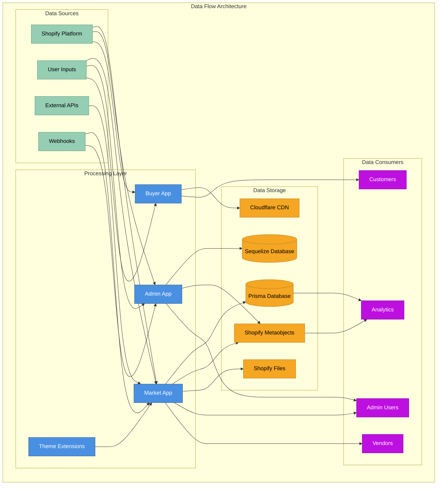

## 👥 User Journey Data Flows

### Vendor Onboarding Flow
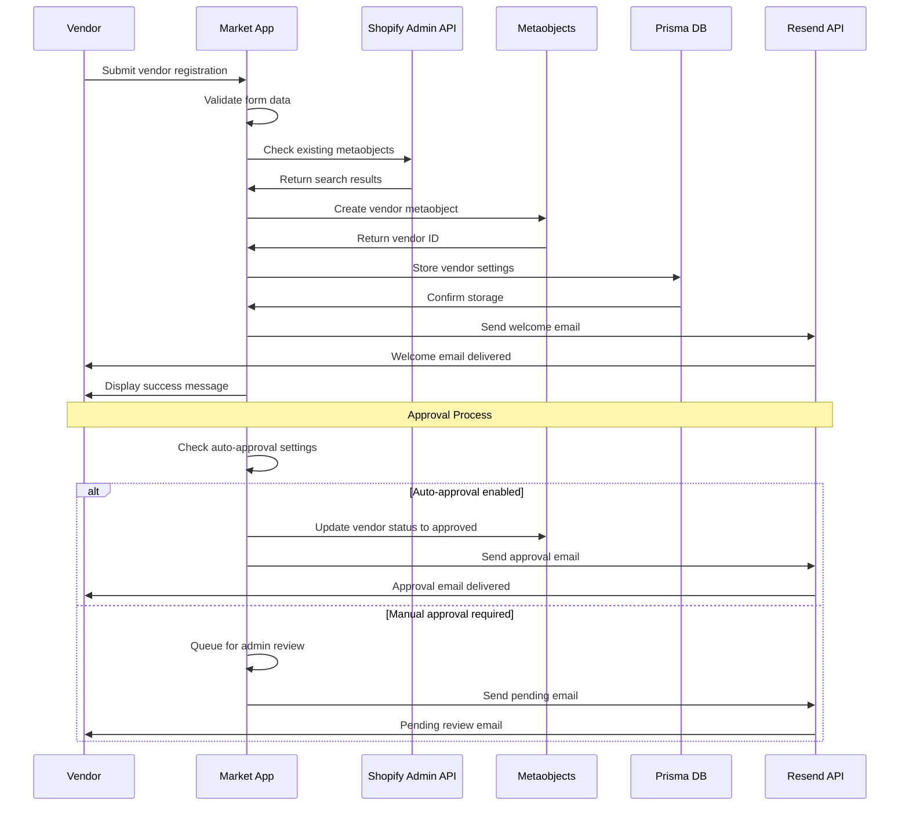

### Product Creation Flow
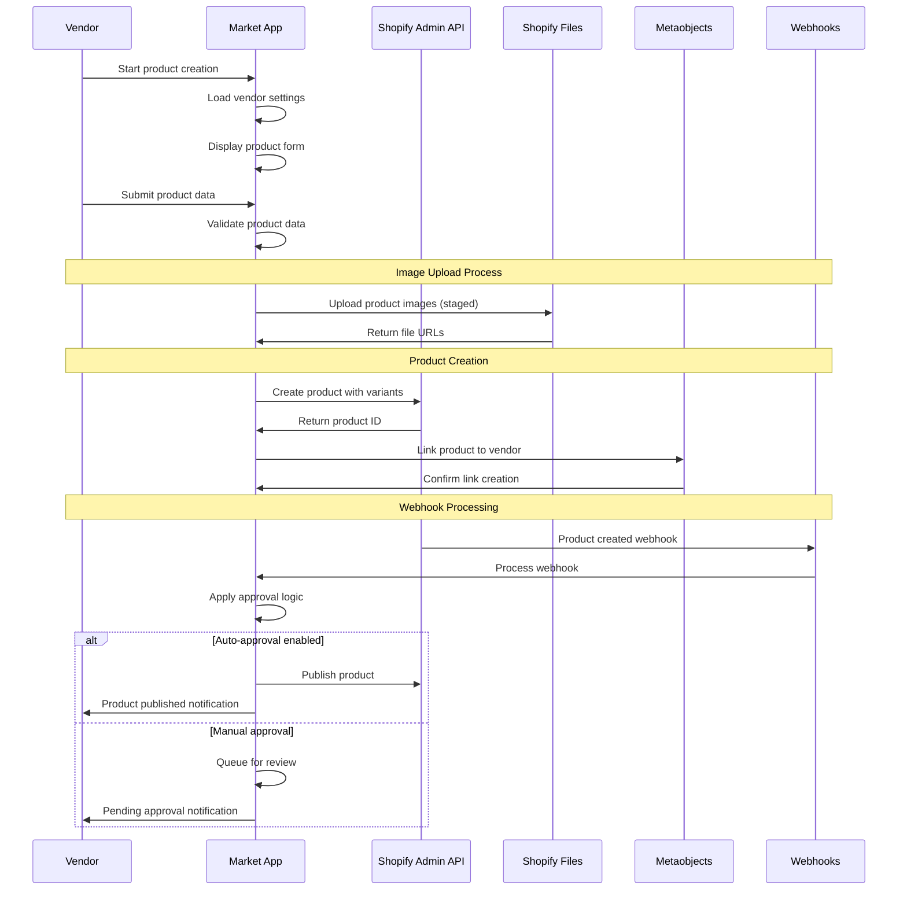

### Customer Purchase Flow
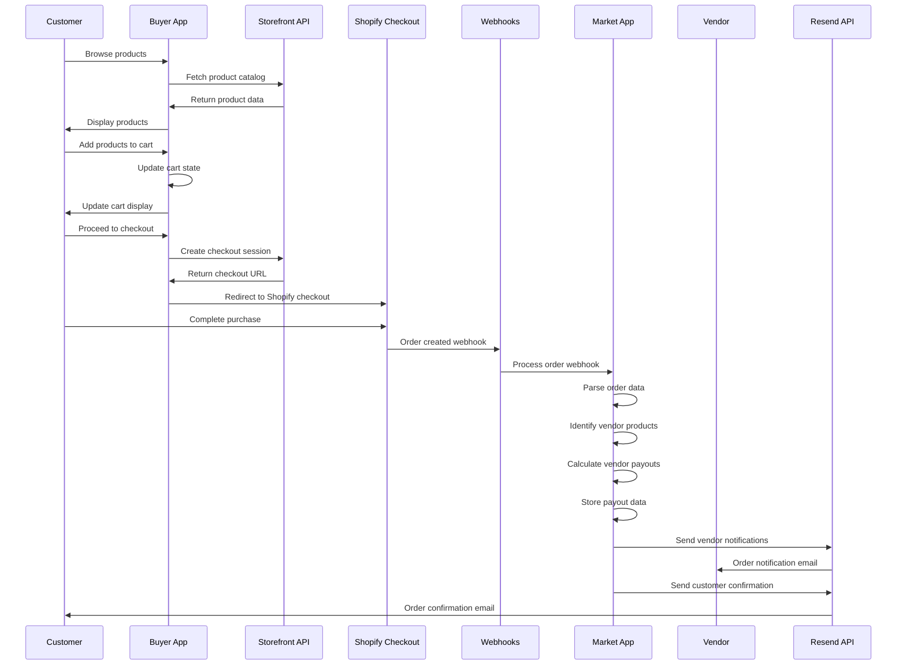

## 🔄 Real-time Data Synchronization

### Webhook Data Processing
```mermaid
graph TB
    subgraph "Webhook Data Processing Flow"
        subgraph "Webhook Reception"
            WR[Webhook Received] --> HV[HMAC Validation]
            HV --> JP[JSON Parsing]
            JP --> ET[Event Type Detection]
        end
        
        subgraph "Event Routing"
            ET --> OE[Order Events]
            ET --> PE[Product Events]
            ET --> CE[Customer Events]
            ET --> AE[App Events]
        end
        
        subgraph "Data Transformation"
            OE --> OT[Order Transform]
            PE --> PT[Product Transform]
            CE --> CT[Customer Transform]
            AE --> AT[App Transform]
        end
        
        subgraph "Data Persistence"
            OT --> PDB2[Store Order Data]
            PT --> SMO2[Update Metaobjects]
            CT --> PDB3[Store Customer Data]
            AT --> PDB4[Store App Data]
        end
        
        subgraph "Business Logic"
            PDB2 --> PC[Payout Calculation]
            SMO2 --> PA[Product Approval]
            PDB3 --> UN[User Notification]
            PDB4 --> AC[App Configuration]
        end
        
        subgraph "Notification System"
            PC --> VN2[Vendor Notification]
            PA --> AN[Admin Notification]
            UN --> EN[Email Notification]
            AC --> SN[System Notification]
        end
    end
    
    classDef reception fill:#4A90E2,stroke:#2E5C8A,color:#fff
    classDef routing fill:#7ED321,stroke:#5BA517,color:#000
    classDef transform fill:#BD10E0,stroke:#8B0A99,color:#fff
    classDef persistence fill:#F5A623,stroke:#B8841A,color:#000
    classDef business fill:#50E3C2,stroke:#38A594,color:#000
    classDef notification fill:#96CEB4,stroke:#5A9B7C,color:#000
    
    class WR,HV,JP,ET reception
    class OE,PE,CE,AE routing
    class OT,PT,CT,AT transform
    class PDB2,SMO2,PDB3,PDB4 persistence
    class PC,PA,UN,AC business
    class VN2,AN,EN,SN notification
```

### Data Synchronization Patterns
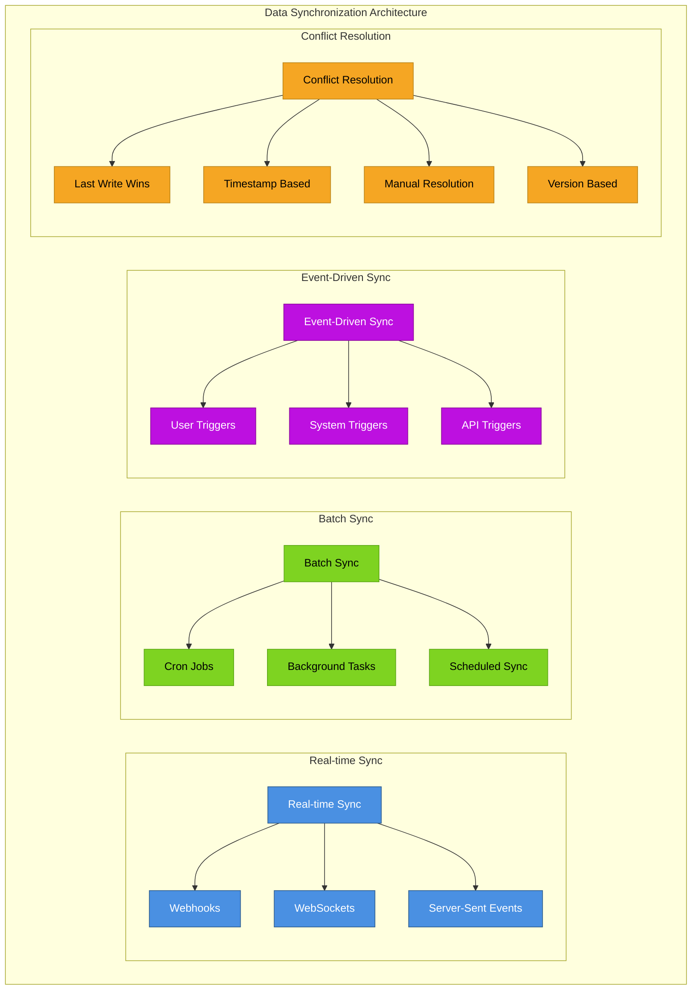

## 💾 Data Storage Patterns

### Database Data Flow
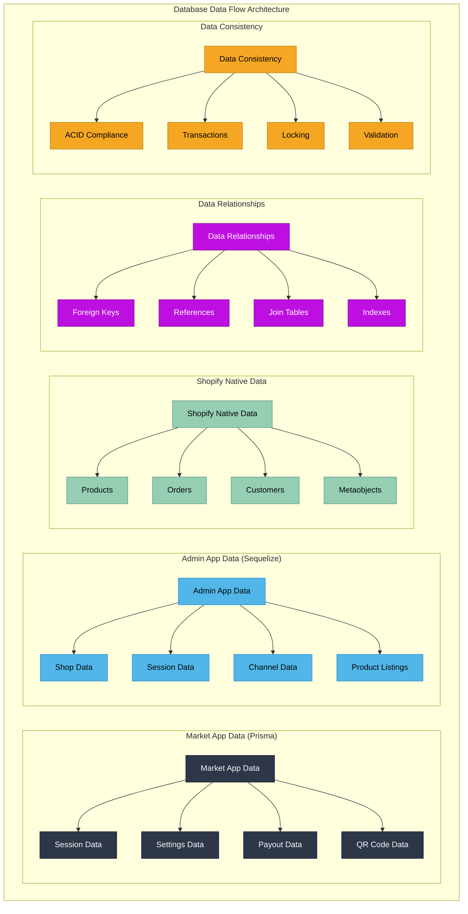

### Data Migration Flow
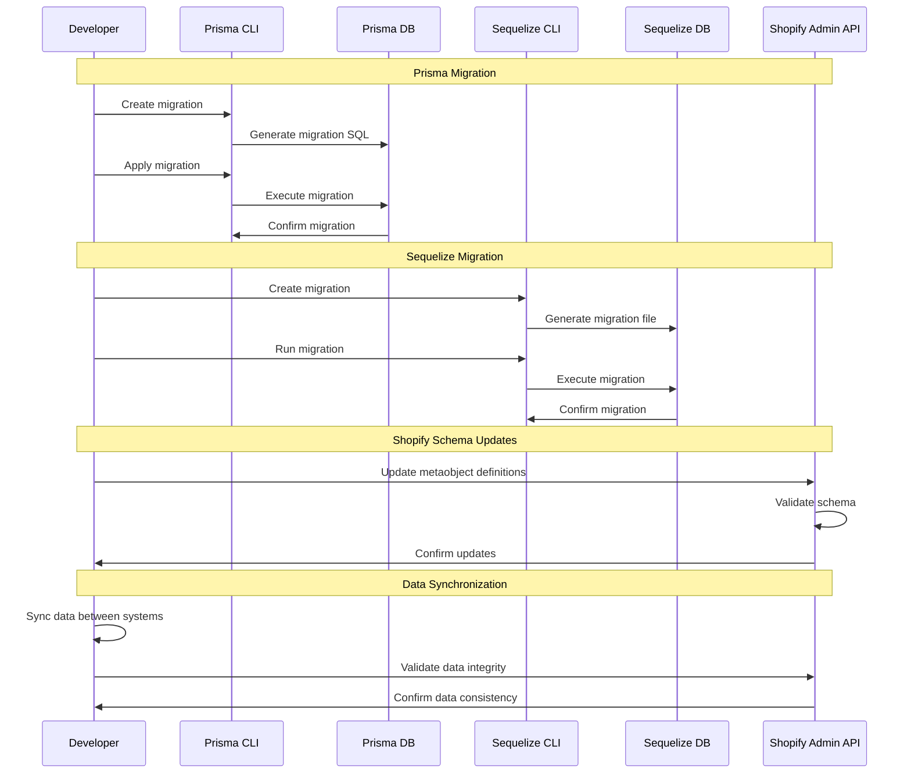

## 📊 Analytics Data Pipeline

### Analytics Data Flow
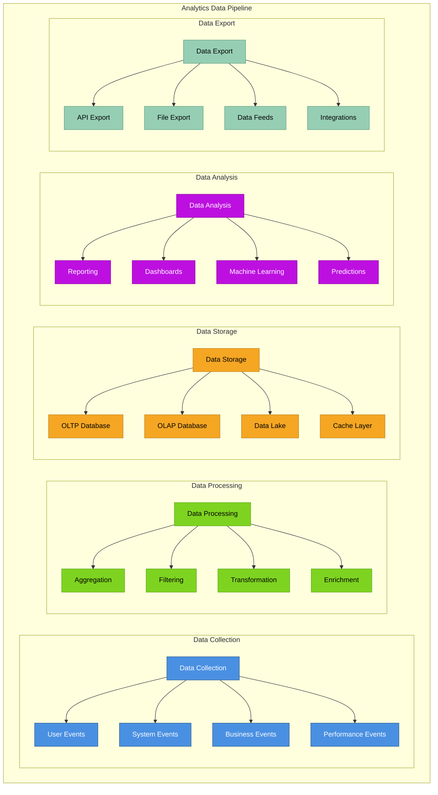

### Business Intelligence Flow
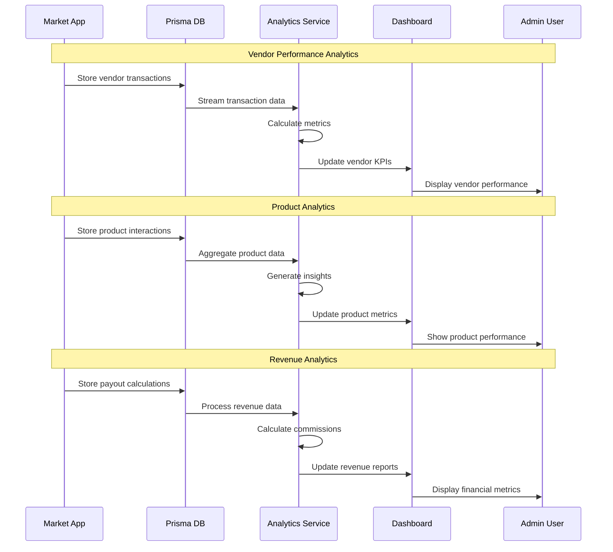

## 🔒 Data Security & Privacy

### Data Protection Flow
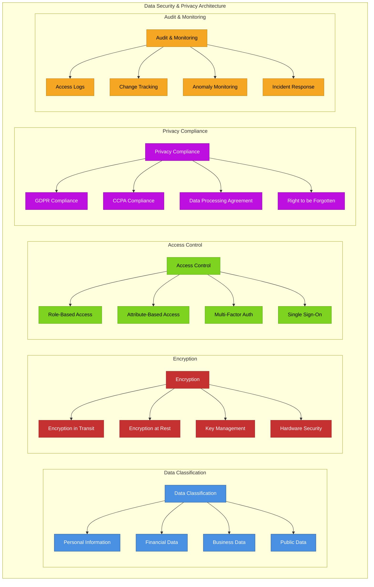

## 🔄 Data Backup & Recovery

### Backup Strategy
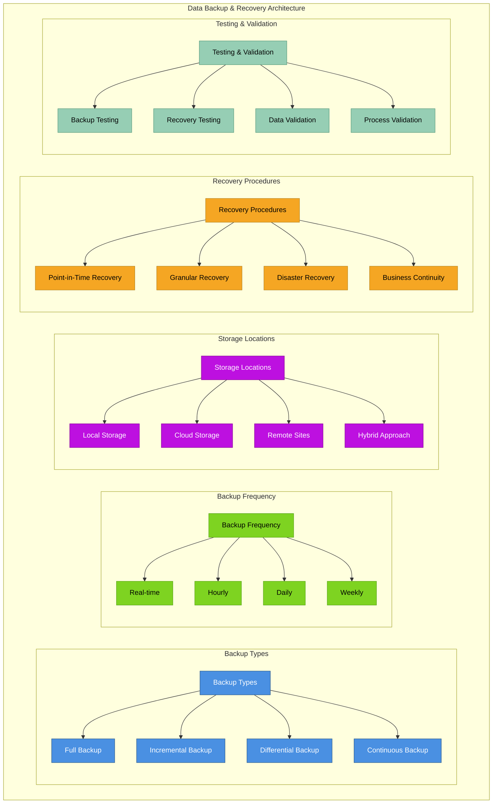

## 📈 Performance Optimization

### Data Performance Flow
```mermaid
graph TB
    subgraph "Data Performance Optimization"
        subgraph "Query Optimization"
            QO[Query Optimization] --> IDX2[Database Indexes]
            QO --> QP[Query Planning]
            QO --> QC4[Query Caching]
            QO --> QB2[Query Batching]
        end
        
        subgraph "Caching Strategy"
            CS6[Caching Strategy] --> L1[L1 Cache (Memory)]
            CS6 --> L2[L2 Cache (Redis)]
            CS6 --> L3[L3 Cache (CDN)]
            CS6 --> APP[Application Cache]
        end
        
        subgraph "Data Partitioning"
            DP4[Data Partitioning] --> HP[Horizontal Partitioning]
            DP4 --> VP[Vertical Partitioning]
            DP4 --> FP[Functional Partitioning]
            DP4 --> TP[Temporal Partitioning]
        end
        
        subgraph "Connection Management"
            CM[Connection Management] --> POOL[Connection Pooling]
            CM --> LB[Load Balancing]
            CM --> REPL[Replication]
            CM --> SHARD[Sharding]
        end
    end
    
    classDef query fill:#4A90E2,stroke:#2E5C8A,color:#fff
    classDef caching fill:#7ED321,stroke:#5BA517,color:#000
    classDef partitioning fill:#BD10E0,stroke:#8B0A99,color:#fff
    classDef connection fill:#F5A623,stroke:#B8841A,color:#000
    
    class QO,IDX2,QP,QC4,QB2 query
    class CS6,L1,L2,L3,APP caching
    class DP4,HP,VP,FP,TP partitioning
    class CM,POOL,LB,REPL,SHARD connection
```

---

**Previous:** [← API Integrations](./06-api-integrations.md) | **Next:** [Authentication & Security →](./08-authentication-security.md)