# Authentication & Security

This document details the comprehensive authentication, authorization, and security architecture across all applications in the Shopify Marketplace ecosystem.

## 🔐 Security Architecture Overview

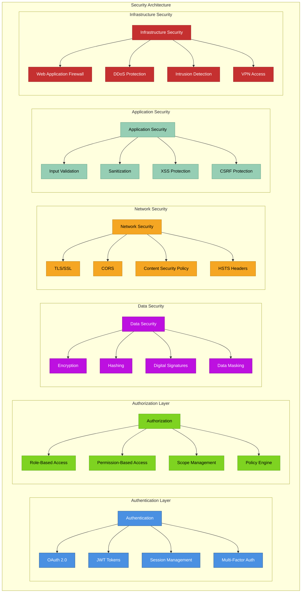

## 🔑 Authentication Flows

### Shopify OAuth Flow
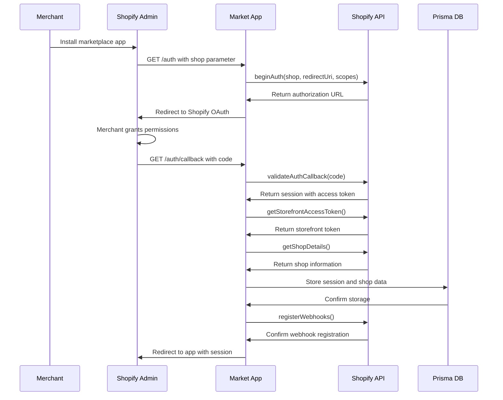

### Session Token Validation
```mermaid
graph TB
    subgraph "Session Token Validation Flow"
        subgraph "Token Reception"
            TR[Token Reception] --> REQ[Request Headers]
            REQ --> AUTH2[Authorization Header]
            AUTH2 --> BEAR[Bearer Token]
        end
        
        subgraph "Token Extraction"
            BEAR --> EXT[Extract JWT]
            EXT --> DEC[Decode Token]
            DEC --> VER[Verify Signature]
            VER --> EXP[Check Expiration]
        end
        
        subgraph "Payload Validation"
            EXP --> PAY[Extract Payload]
            PAY --> ISS[Verify Issuer]
            ISS --> AUD[Verify Audience]
            AUD --> SHOP[Extract Shop Domain]
        end
        
        subgraph "Session Loading"
            SHOP --> LOAD[Load Session]
            LOAD --> VALID[Validate Session]
            VALID --> CTX[Create Context]
            CTX --> NEXT[Continue Request]
        end
        
        subgraph "Error Handling"
            VER --> ERR[Token Invalid]
            EXP --> ERR2[Token Expired]
            VALID --> ERR3[Session Invalid]
            ERR --> REJECT[Reject Request]
            ERR2 --> REJECT
            ERR3 --> REJECT
        end
    end
    
    classDef reception fill:#4A90E2,stroke:#2E5C8A,color:#fff
    classDef extraction fill:#7ED321,stroke:#5BA517,color:#000
    classDef validation fill:#BD10E0,stroke:#8B0A99,color:#fff
    classDef session fill:#F5A623,stroke:#B8841A,color:#000
    classDef error fill:#C53030,stroke:#9B2C2C,color:#fff
    
    class TR,REQ,AUTH2,BEAR reception
    class EXT,DEC,VER,EXP extraction
    class PAY,ISS,AUD,SHOP validation
    class LOAD,VALID,CTX,NEXT session
    class ERR,ERR2,ERR3,REJECT error
```

### Multi-Application Authentication
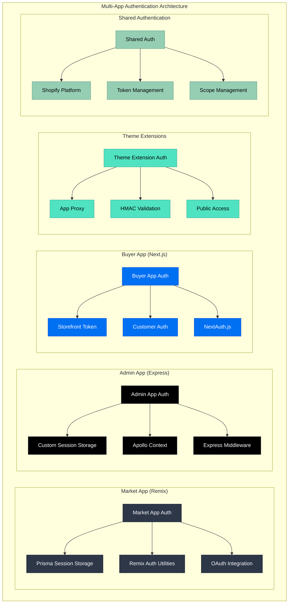

## 🛡️ Authorization System

### Role-Based Access Control (RBAC)
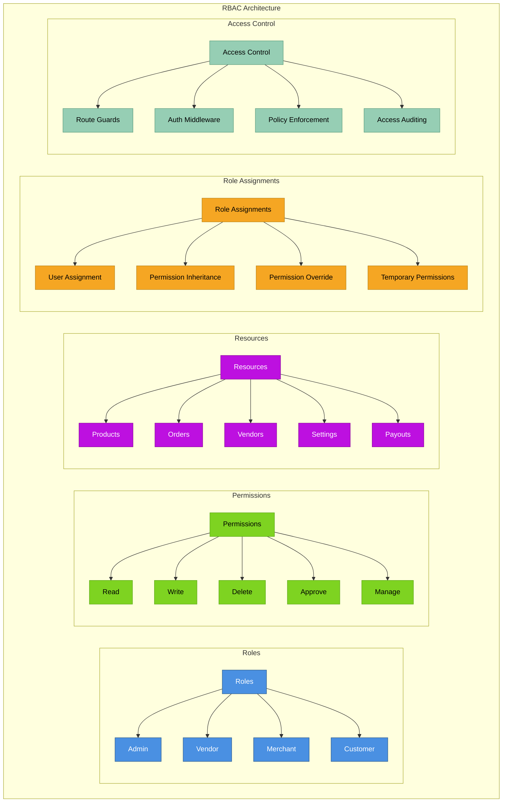

### Permission Matrix
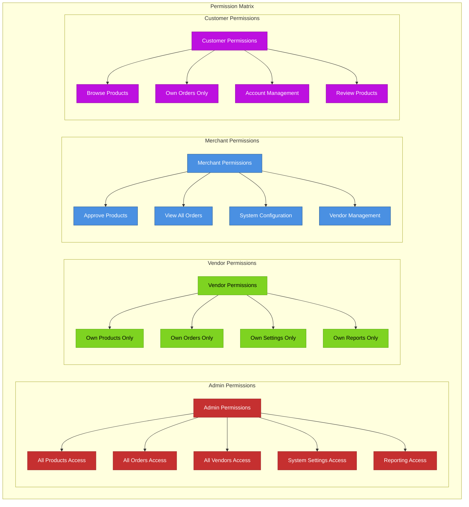

## 🔒 Data Security

### Encryption Strategy
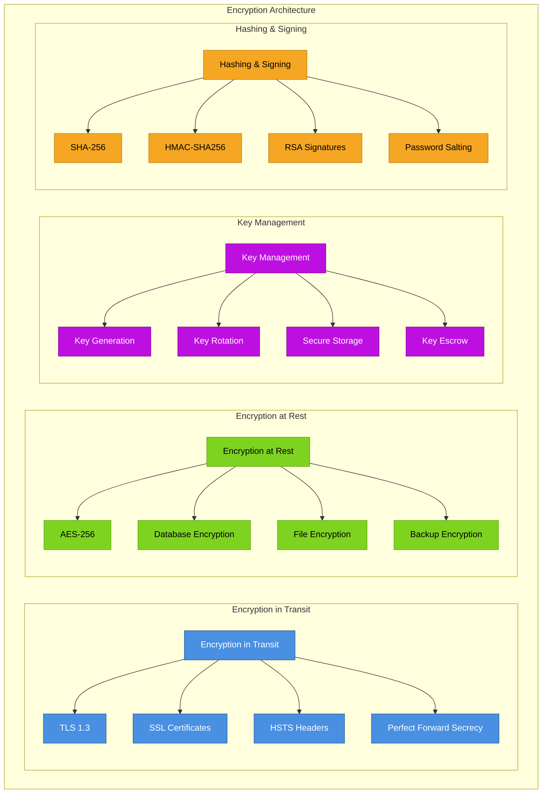

### Sensitive Data Handling
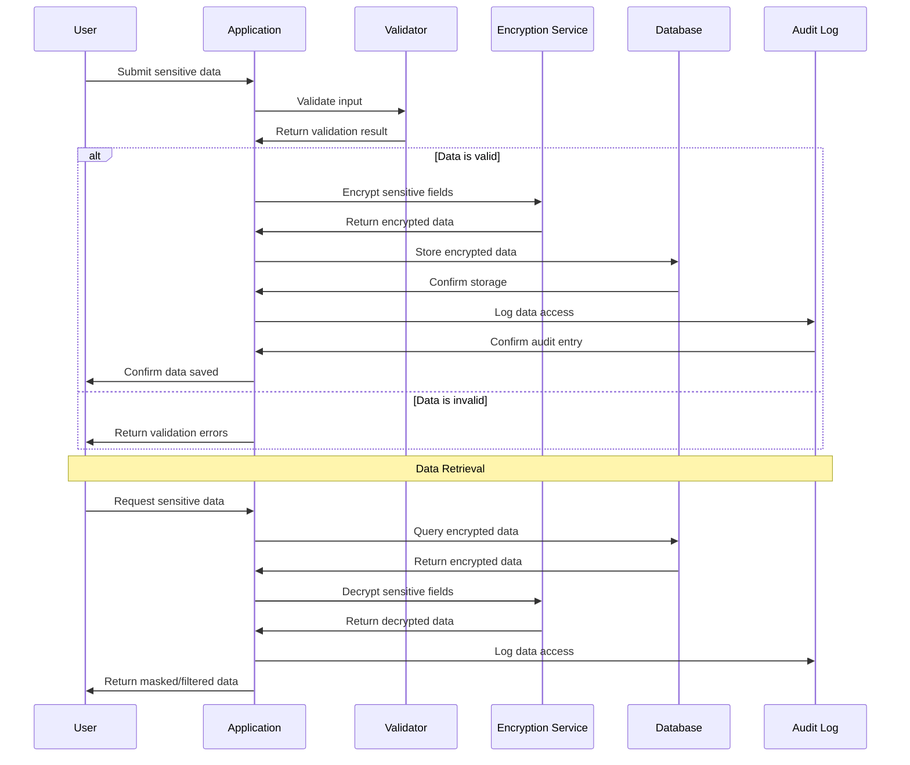

## 🛡️ Application Security

### Input Validation & Sanitization
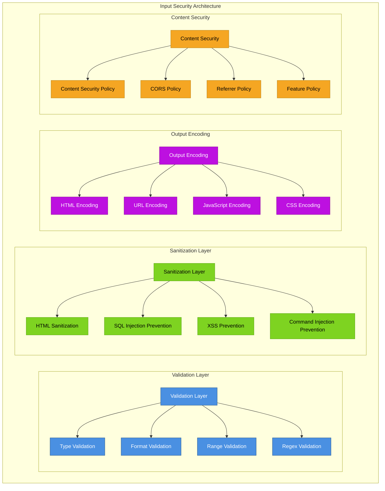

### CSRF & XSS Protection
```mermaid
graph TB
    subgraph "Client-Side Attack Protection"
        subgraph "CSRF Protection"
            CSRF2[CSRF Protection] --> TOKEN[CSRF Tokens]
            CSRF2 --> SAME[SameSite Cookies]
            CSRF2 --> ORIGIN[Origin Validation]
            CSRF2 --> REFERER[Referer Validation]
        end
        
        subgraph "XSS Protection"
            XSS3[XSS Protection] --> ESCAPE[Output Escaping]
            XSS3 --> VALIDATE[Input Validation]
            XSS3 --> CSP3[Content Security Policy]
            XSS3 --> HTTPONLY[HttpOnly Cookies]
        end
        
        subgraph "Session Security"
            SS2[Session Security] --> SECURE[Secure Cookies]
            SS2 --> REGENERATE[Session Regeneration]
            SS2 --> TIMEOUT[Session Timeout]
            SS2 --> FIXATION[Session Fixation Prevention]
        end
        
        subgraph "Browser Security"
            BS[Browser Security] --> HSTS3[HSTS Headers]
            BS --> NOSNIFF[X-Content-Type-Options]
            BS → FRAME[X-Frame-Options]
            BS → XSS4[X-XSS-Protection]
        end
    end
    
    classDef csrf fill:#4A90E2,stroke:#2E5C8A,color:#fff
    classDef xss fill:#C53030,stroke:#9B2C2C,color:#fff
    classDef session fill:#7ED321,stroke:#5BA517,color:#000
    classDef browser fill:#BD10E0,stroke:#8B0A99,color:#fff
    
    class CSRF2,TOKEN,SAME,ORIGIN,REFERER csrf
    class XSS3,ESCAPE,VALIDATE,CSP3,HTTPONLY xss
    class SS2,SECURE,REGENERATE,TIMEOUT,FIXATION session
    class BS,HSTS3,NOSNIFF,FRAME,XSS4 browser
```

## 🔍 Security Monitoring & Auditing

### Security Monitoring
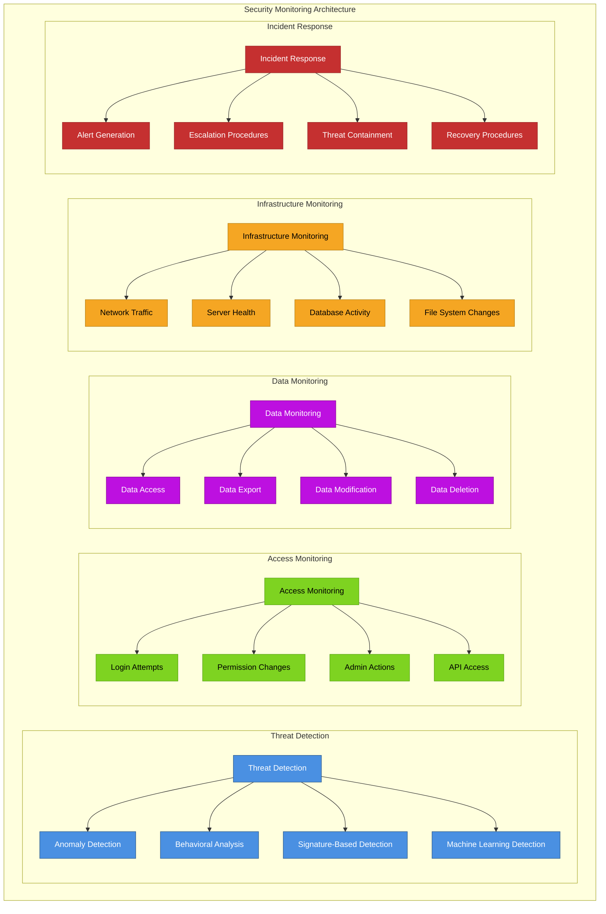

### Audit Trail System
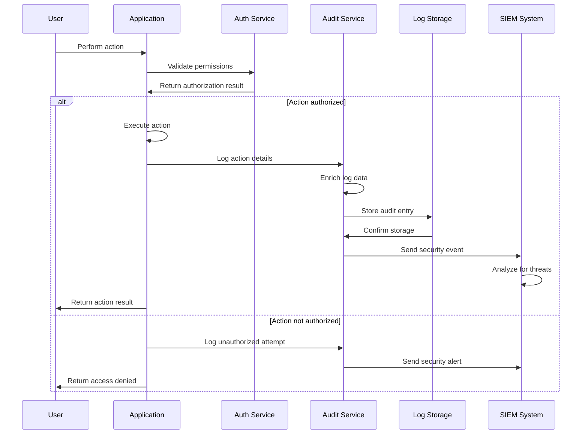

## 🚨 Compliance & Governance

### Compliance Framework
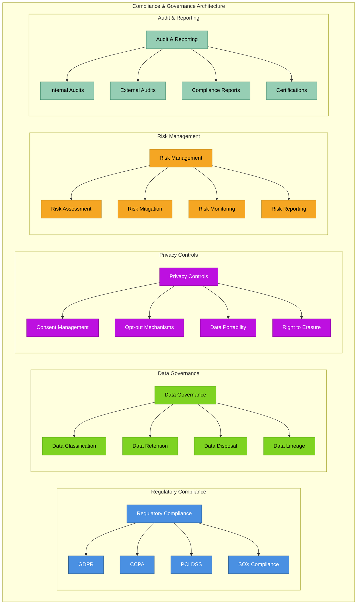

## 🔧 Security Best Practices

### Security Implementation Checklist
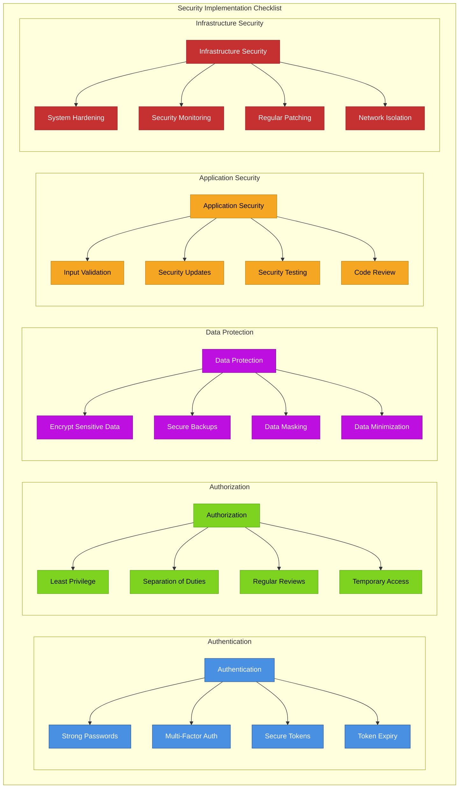

---

**Previous:** [← Data Flow](./07-data-flow.md) | **Next:** [Deployment Architecture →](./09-deployment-architecture.md)