# Deployment Architecture

This document details the comprehensive deployment architecture for the Shopify Marketplace ecosystem, including infrastructure, hosting strategies, CI/CD pipelines, and operational procedures.

## 🚀 Deployment Overview

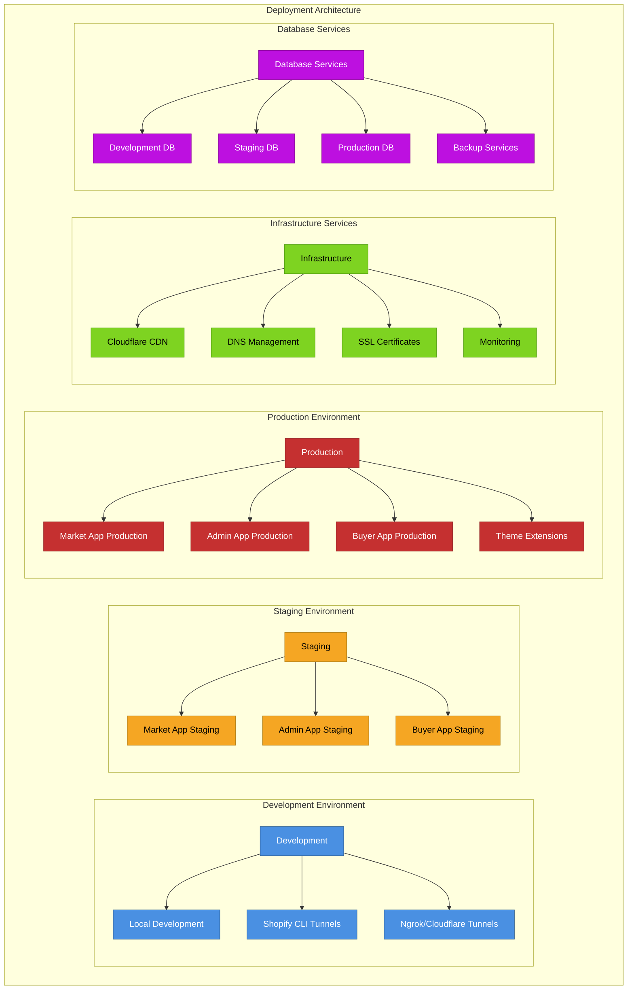

## 🏗️ Infrastructure Architecture

### Hosting Platform Strategy
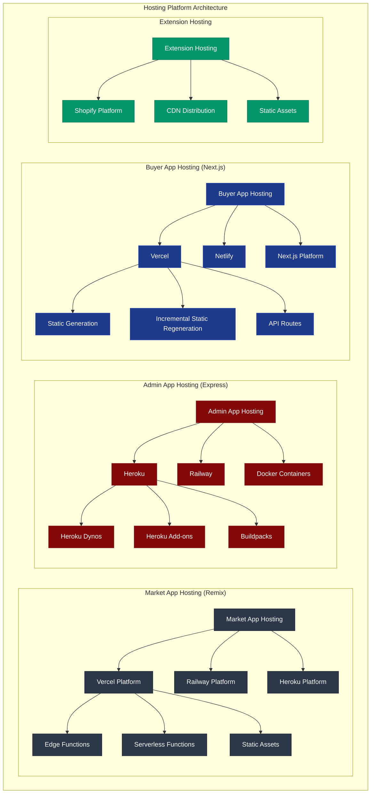

### Database Deployment Strategy
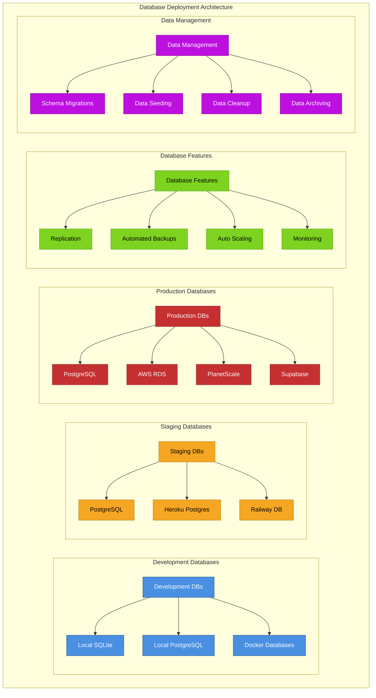

## 🔄 CI/CD Pipeline

### Continuous Integration Flow
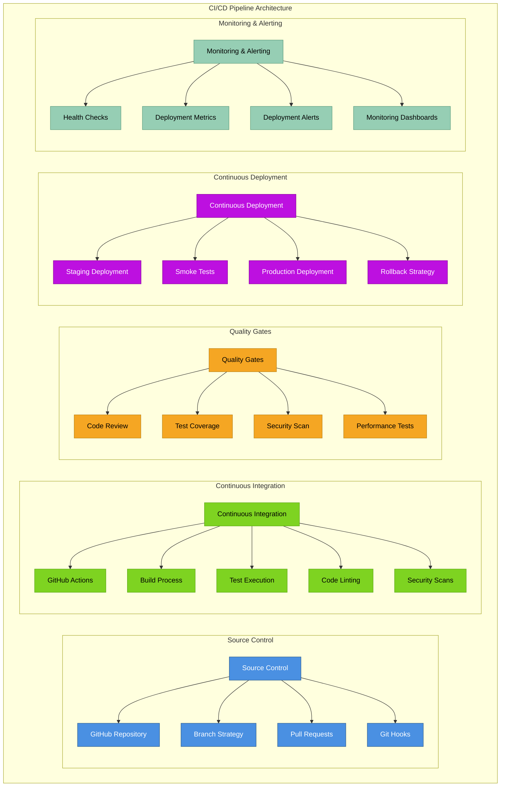

### GitHub Actions Workflow
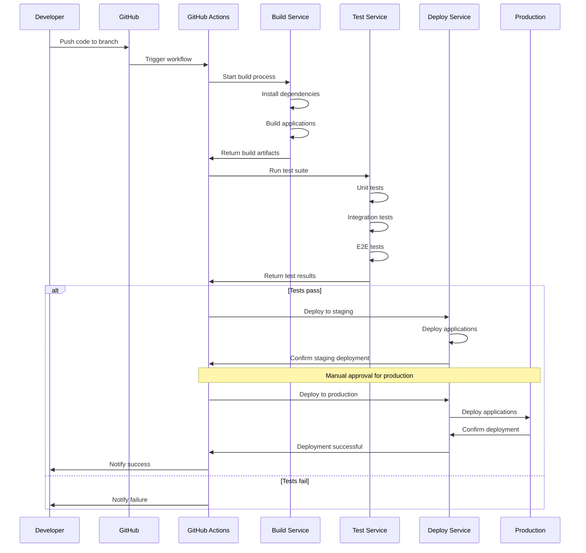

## 🌐 CDN & Performance

### Content Delivery Network
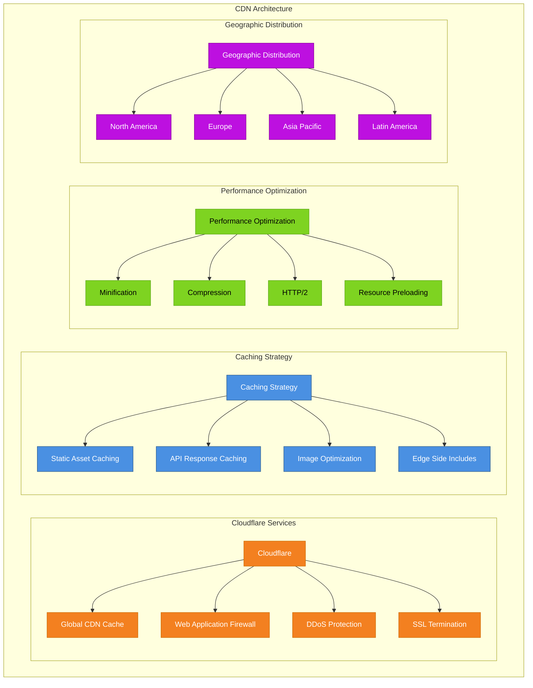

### Asset Optimization Pipeline
```mermaid
sequenceDiagram
    participant DEV as Developer
    participant BUILD as Build System
    participant OPT as Optimization Service
    participant CDN as CDN
    participant USER as End User
    
    DEV->>BUILD: Upload assets
    BUILD->>OPT: Process assets
    OPT->>OPT: Minify CSS/JS
    OPT->>OPT: Optimize images
    OPT->>OPT: Generate WebP/AVIF
    OPT->>OPT: Create responsive variants
    OPT->>CDN: Upload optimized assets
    CDN->>CDN: Distribute to edge locations
    
    USER->>CDN: Request asset
    CDN->>CDN: Check cache
    alt Asset cached
        CDN->>USER: Serve cached asset
    else Asset not cached
        CDN->>OPT: Fetch asset
        OPT->>CDN: Return optimized asset
        CDN->>USER: Serve asset
        CDN->>CDN: Cache for future requests
    end
```

## 🔧 Environment Configuration

### Environment Management
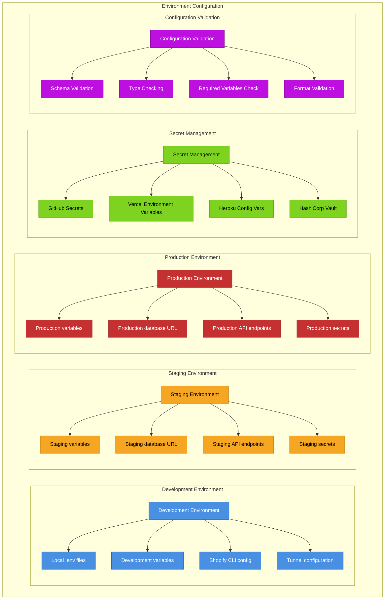

### Configuration Schema
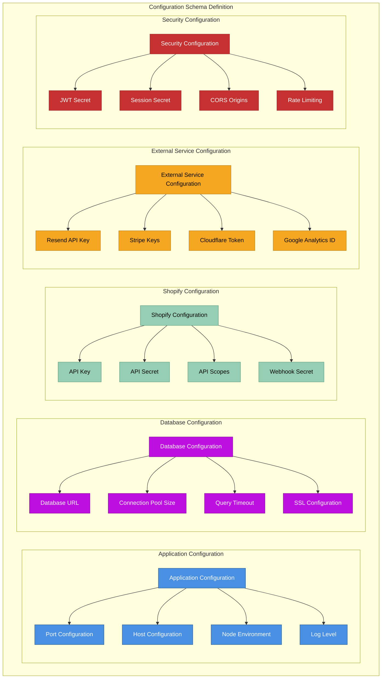

## 📊 Monitoring & Observability

### Application Monitoring
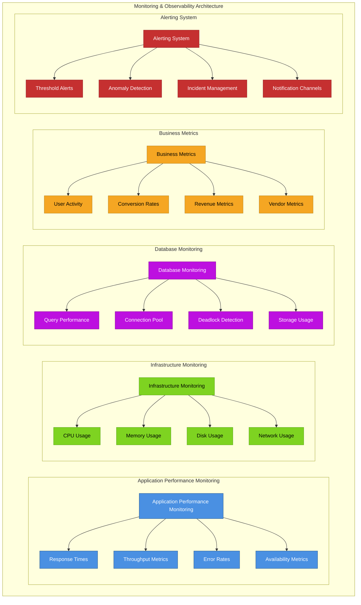

### Logging Strategy
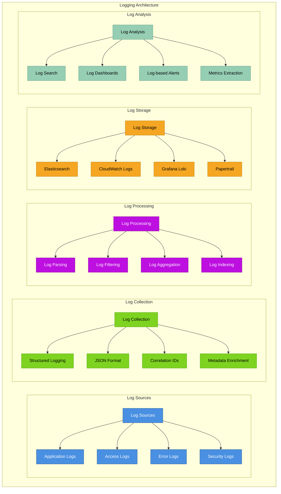

## 🛡️ Disaster Recovery

### Backup & Recovery Strategy
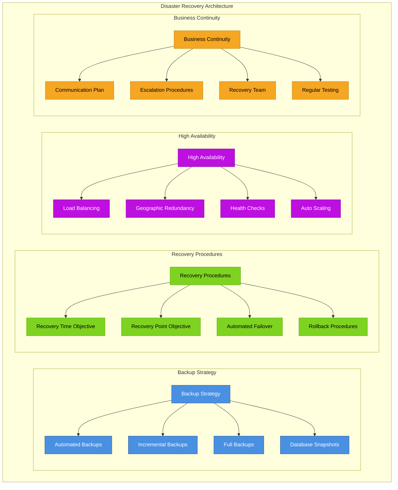

## 🔄 Scaling Strategy

### Horizontal & Vertical Scaling
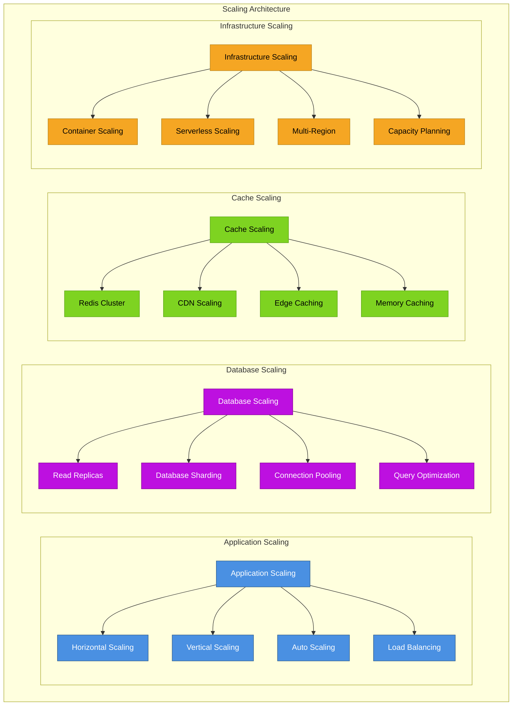

---

**Previous:** [← Authentication & Security](./08-authentication-security.md) | **Next:** [Development Workflow →](./10-development-workflow.md)