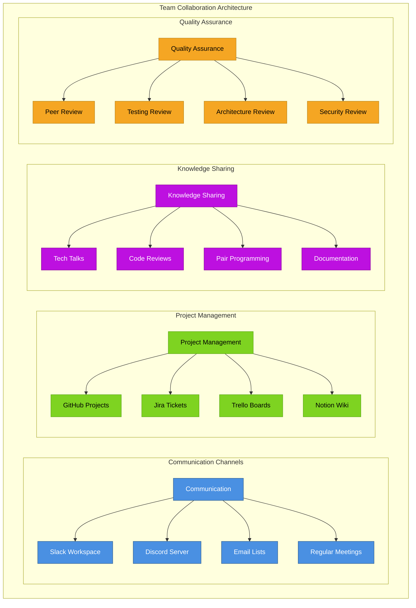

# Development Workflow

This document details the comprehensive development workflow for the Shopify Marketplace ecosystem, including development processes, tools, best practices, and team collaboration patterns.

## 🔄 Development Workflow Overview


## 🌿 Git Workflow & Branching Strategy

### Git Flow Implementation


### Pull Request Workflow


## 🛠️ Development Environment Setup

### Local Development Stack
```mermaid
graph TB
    subgraph "Local Development Environment"
        subgraph "Prerequisites"
            PREREQ[Prerequisites] --> NODE[Node.js 18.20+]
            PREREQ --> PNPM[PNPM Package Manager]
            PREREQ --> GIT[Git Version Control]
            PREREQ --> SHOPIFY_CLI[Shopify CLI]
        end
        
        subgraph "Database Setup"
            DB_SETUP[Database Setup] --> SQLITE[SQLite (Development)]
            DB_SETUP --> POSTGRES[PostgreSQL (Local)]
            DB_SETUP --> DOCKER_DB[Docker Databases]
            DB_SETUP --> PRISMA_CLI[Prisma CLI]
        end
        
        subgraph "Environment Configuration"
            ENV_CONFIG[Environment Configuration] --> ENV_FILES[.env Files]
            ENV_CONFIG --> SHOPIFY_APP[Shopify App Config]
            ENV_CONFIG --> TUNNEL_SETUP[Tunnel Setup]
            ENV_CONFIG --> WEBHOOK_CONFIG[Webhook Configuration]
        end
        
        subgraph "Development Tools"
            DEV_TOOLS[Development Tools] --> VS_CODE[VS Code]
            DEV_TOOLS --> EXTENSIONS[VS Code Extensions]
            DEV_TOOLS --> DEBUGGER[Node.js Debugger]
            DEV_TOOLS --> BROWSER_TOOLS[Browser Dev Tools]
        end
        
        subgraph "Testing Tools"
            TEST_TOOLS[Testing Tools] --> JEST[Jest Testing Framework]
            TEST_TOOLS --> VITEST[Vitest (Vite Testing)]
            TEST_TOOLS[Testing Tools] --> PLAYWRIGHT[Playwright E2E]
            TEST_TOOLS --> CYPRESS[Cypress Testing]
        end
    end
    
    classDef prerequisites fill:#4A90E2,stroke:#2E5C8A,color:#fff
    classDef database fill:#BD10E0,stroke:#8B0A99,color:#fff
    classDef environment fill:#7ED321,stroke:#5BA517,color:#000
    classDef tools fill:#F5A623,stroke:#B8841A,color:#000
    classDef testing fill:#96CEB4,stroke:#5A9B7C,color:#000
    
    class PREREQ,NODE,PNPM,GIT,SHOPIFY_CLI prerequisites
    class DB_SETUP,SQLITE,POSTGRES,DOCKER_DB,PRISMA_CLI database
    class ENV_CONFIG,ENV_FILES,SHOPIFY_APP,TUNNEL_SETUP,WEBHOOK_CONFIG environment
    class DEV_TOOLS,VS_CODE,EXTENSIONS,DEBUGGER,BROWSER_TOOLS tools
    class TEST_TOOLS,JEST,VITEST,PLAYWRIGHT,CYPRESS testing
```

### Application-Specific Setup
```mermaid
graph TB
    subgraph "Application Setup Workflows"
        subgraph "Market App Setup (Remix)"
            MA_SETUP[Market App Setup] --> PNPM_INSTALL[pnpm install]
            MA_SETUP --> PRISMA_SETUP[Prisma setup]
            MA_SETUP --> ENV_MARKET[.env configuration]
            MA_SETUP --> SHOPIFY_DEV[shopify app dev]
        end
        
        subgraph "Admin App Setup (Express)"
            AA_SETUP[Admin App Setup] --> YARN_INSTALL[yarn install]
            AA_SETUP --> SEQUELIZE_SETUP[Sequelize setup]
            AA_SETUP --> MIGRATION[Run migrations]
            AA_SETUP → EXPRESS_DEV[Express dev server]
        end
        
        subgraph "Buyer App Setup (Next.js)"
            BA_SETUP[Buyer App Setup] --> NPM_INSTALL[npm install]
            BA_SETUP --> NEXT_CONFIG[Next.js config]
            BA_SETUP --> ENV_BUYER[Environment setup]
            BA_SETUP --> NEXT_DEV[next dev]
        end
        
        subgraph "Extension Setup"
            EXT_SETUP[Extension Setup] --> EXT_INSTALL[Extension dependencies]
            EXT_SETUP --> VITE_CONFIG[Vite configuration]
            EXT_SETUP --> PROXY_CONFIG[App proxy setup]
            EXT_SETUP --> EXT_DEV[Extension dev mode]
        end
    end
    
    classDef marketapp fill:#2D3748,stroke:#1A202C,color:#fff
    classDef adminapp fill:#830909,stroke:#7F1D1D,color:#fff
    classDef buyerapp fill:#1E3A8A,stroke:#1E40AF,color:#fff
    classDef extensions fill:#059669,stroke:#047857,color:#fff
    
    class MA_SETUP,PNPM_INSTALL,PRISMA_SETUP,ENV_MARKET,SHOPIFY_DEV marketapp
    class AA_SETUP,YARN_INSTALL,SEQUELIZE_SETUP,MIGRATION,EXPRESS_DEV adminapp
    class BA_SETUP,NPM_INSTALL,NEXT_CONFIG,ENV_BUYER,NEXT_DEV buyerapp
    class EXT_SETUP,EXT_INSTALL,VITE_CONFIG,PROXY_CONFIG,EXT_DEV extensions
```

## 🧪 Testing Strategy

### Testing Pyramid


### Test Automation Pipeline


## 📋 Code Quality & Standards

### Code Quality Pipeline


### Coding Standards


## 🔧 Development Tools & IDE Configuration

### IDE Setup & Extensions


### Pre-commit Hooks & Automation


## 📚 Documentation Strategy

### Documentation Architecture


## 🚀 Release Management

### Release Pipeline


### Version Control Strategy
```mermaid
graph TB
    subgraph "Version Control Strategy"
        subgraph "Semantic Versioning"
            SEMVER[Semantic Versioning] --> MAJOR[Major (X.0.0)]
            SEMVER --> MINOR[Minor (0.X.0)]
            SEMVER --> PATCH[Patch (0.0.X)]
            SEMVER --> PRERELEASE[Pre-release (0.0.0-alpha)]
        end
        
        subgraph "Release Types"
            REL_TYPES[Release Types] --> STABLE[Stable Release]
            REL_TYPES --> RC[Release Candidate]
            REL_TYPES --> BETA[Beta Release]
            REL_TYPES --> ALPHA[Alpha Release]
        end
        
        subgraph "Tagging Strategy"
            TAGGING[Tagging Strategy] --> VERSION_TAGS[Version Tags]
            TAGGING --> ANNOTATED_TAGS[Annotated Tags]
            TAGGING --> RELEASE_TAGS[Release Tags]
            TAGGING --> HOTFIX_TAGS[Hotfix Tags]
        end
        
        subgraph "Branch Protection"
            PROTECTION[Branch Protection] --> REQUIRED_REVIEWS[Required Reviews]
            PROTECTION --> STATUS_CHECKS[Status Checks]
            PROTECTION --> ADMIN_ENFORCE[Admin Enforcement]
            PROTECTION --> LINEAR_HISTORY[Linear History]
        end
    end
    
    classDef versioning fill:#4A90E2,stroke:#2E5C8A,color:#fff
    classDef types fill:#7ED321,stroke:#5BA517,color:#000
    classDef tagging fill:#BD10E0,stroke:#8B0A99,color:#fff
    classDef protection fill:#C53030,stroke:#9B2C2C,color:#fff
    
    class SEMVER,MAJOR,MINOR,PATCH,PRERELEASE versioning
    class REL_TYPES,STABLE,RC,BETA,ALPHA types
    class TAGGING,VERSION_TAGS,ANNOTATED_TAGS,RELEASE_TAGS,HOTFIX_TAGS tagging
    class PROTECTION,REQUIRED_REVIEWS,STATUS_CHECKS,ADMIN_ENFORCE,LINEAR_HISTORY protection
```

## 👥 Team Collaboration

### Collaboration Workflow


## 🔍 Troubleshooting & Support

### Support Workflow


---

**Previous:** [← Deployment Architecture](./09-deployment-architecture.md) | **Back to:** [README](./README.md)